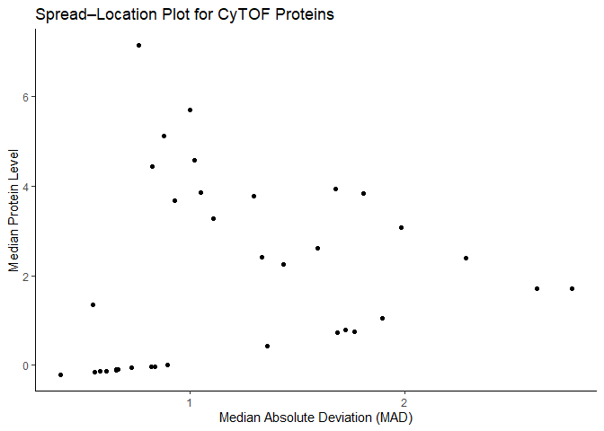

FA2
================
Espiritu, Joseph Raphael M.
2026-02-05

Introduction

This assignment analyzes CyTOF (Cytometry by Time-of-Flight) data, where
each row represents a single cell and each column represents a protein
marker. The objectives are to reshape the dataset into tidy format,
compute summary statistics for each protein, and visualize the
relationship between the median protein level and variability using a
spread–location plot. Additional practice in data reshaping is
demonstrated using a gymnastics dataset from the dcldata package.

``` r
library(tidyverse)
```

    ## ── Attaching core tidyverse packages ──────────────────────── tidyverse 2.0.0 ──
    ## ✔ dplyr     1.1.4     ✔ readr     2.1.5
    ## ✔ forcats   1.0.0     ✔ stringr   1.5.1
    ## ✔ ggplot2   3.5.2     ✔ tibble    3.2.1
    ## ✔ lubridate 1.9.4     ✔ tidyr     1.3.1
    ## ✔ purrr     1.0.4     
    ## ── Conflicts ────────────────────────────────────────── tidyverse_conflicts() ──
    ## ✖ dplyr::filter() masks stats::filter()
    ## ✖ dplyr::lag()    masks stats::lag()
    ## ℹ Use the conflicted package (<http://conflicted.r-lib.org/>) to force all conflicts to become errors

``` r
# Read the CyTOF dataset
# Rows correspond to cells
# Columns correspond to protein markers
cytof <- read_csv("cytof_one_experiment.csv")
```

    ## Rows: 50000 Columns: 35
    ## ── Column specification ────────────────────────────────────────────────────────
    ## Delimiter: ","
    ## dbl (35): NKp30, KIR3DL1, NKp44, KIR2DL1, GranzymeB, CXCR6, CD161, KIR2DS4, ...
    ## 
    ## ℹ Use `spec()` to retrieve the full column specification for this data.
    ## ℹ Specify the column types or set `show_col_types = FALSE` to quiet this message.

``` r
cytof
```

    ## # A tibble: 50,000 × 35
    ##     NKp30 KIR3DL1  NKp44 KIR2DL1 GranzymeB   CXCR6  CD161 KIR2DS4 NKp46   NKG2D
    ##     <dbl>   <dbl>  <dbl>   <dbl>     <dbl>   <dbl>  <dbl>   <dbl> <dbl>   <dbl>
    ##  1  0.188  3.62   -0.561  -0.294     2.48  -0.145  -0.315  1.94   4.08   2.62  
    ##  2  1.03   1.70   -0.289  -0.480     3.26  -0.0339 -0.411  3.80   3.73  -0.483 
    ##  3  3.00   6.14    1.90    0.482     4.28   1.95   -0.502 -0.320  4.56  -0.507 
    ##  4  4.30  -0.221   0.243  -0.483     3.35   0.926   3.88  -0.170  4.48   1.93  
    ##  5 -0.439 -0.504  -0.153   0.751     3.19  -0.0589  1.09  -0.0503 0.838 -0.458 
    ##  6  2.09  -0.399   3.46   -0.520     4.35  -0.364  -0.571 -0.450  4.06   3.43  
    ##  7 -0.613 -0.117  -0.451   3.55      1.54  -0.414   0.725 -0.0674 2.67  -0.0838
    ##  8 -0.341 -0.253  -0.459   2.90     -0.545 -0.612  -0.128  2.79   0.726  2.10  
    ##  9  2.31  -0.364  -0.573   3.84      2.92   2.46    2.25  -0.376  4.33  -0.0168
    ## 10  3.48  -0.0282 -0.182   4.20      4.74   0.695   5.08   4.19   4.54   2.16  
    ## # ℹ 49,990 more rows
    ## # ℹ 25 more variables: NKG2C <dbl>, X2B4 <dbl>, CD69 <dbl>, KIR3DL1.S1 <dbl>,
    ## #   CD2 <dbl>, KIR2DL5 <dbl>, DNAM.1 <dbl>, CD4 <dbl>, CD8 <dbl>, CD57 <dbl>,
    ## #   TRAIL <dbl>, KIR3DL2 <dbl>, MIP1b <dbl>, CD107a <dbl>, GM.CSF <dbl>,
    ## #   CD16 <dbl>, TNFa <dbl>, ILT2 <dbl>, Perforin <dbl>, KIR2DL2.L3.S2 <dbl>,
    ## #   KIR2DL3 <dbl>, NKG2A <dbl>, NTB.A <dbl>, CD56 <dbl>, INFg <dbl>

Reshape the Data Using pivot_longer

The dataset is reshaped so that:

One column gives the protein identity

One column gives the amount of protein in a cell

The resulting dataset has 50,000 × 35 = 1,750,000 rows

``` r
cytof_long <- cytof %>%
  pivot_longer(
    cols = everything(),   # all protein columns
    names_to = "protein",  # protein identity
    values_to = "amount"   # protein level
  )
cytof_long
```

    ## # A tibble: 1,750,000 × 2
    ##    protein   amount
    ##    <chr>      <dbl>
    ##  1 NKp30      0.188
    ##  2 KIR3DL1    3.62 
    ##  3 NKp44     -0.561
    ##  4 KIR2DL1   -0.294
    ##  5 GranzymeB  2.48 
    ##  6 CXCR6     -0.145
    ##  7 CD161     -0.315
    ##  8 KIR2DS4    1.94 
    ##  9 NKp46      4.08 
    ## 10 NKG2D      2.62 
    ## # ℹ 1,749,990 more rows

Median and Median Absolute Deviation by Protein

For each protein marker, the median expression level and the median
absolute deviation (MAD) are computed.

``` r
cytof_summary <- cytof_long %>%
  group_by(protein) %>%
  summarise(
    median = median(amount), # median protein level
    mad = mad(amount)        # median absolute deviation
  )
cytof_summary
```

    ## # A tibble: 35 × 3
    ##    protein  median   mad
    ##    <chr>     <dbl> <dbl>
    ##  1 CD107a  -0.122  0.609
    ##  2 CD16     5.12   0.874
    ##  3 CD161    0.726  1.69 
    ##  4 CD2      3.95   1.68 
    ##  5 CD4     -0.204  0.395
    ##  6 CD56     5.71   0.998
    ##  7 CD57     3.07   1.99 
    ##  8 CD69     4.59   1.02 
    ##  9 CD8      2.40   2.29 
    ## 10 CXCR6   -0.0581 0.727
    ## # ℹ 25 more rows

Spread–Location Plot

A spread–location (S–L) plot is created with MAD on the x-axis and the
median on the y-axis.

``` r
ggplot(
  cytof_summary,
  aes(x = mad, y = median)
) +
  geom_point() +
  labs(
    x = "Median Absolute Deviation (MAD)",
    y = "Median Protein Level",
    title = "Spread–Location Plot for CyTOF Proteins"
  ) +
  theme_classic()
```

<!-- -->

Interpretation

The spread–location plot shows that the amount of variability in protein
expression changes depending on the typical (median) expression level of
the protein. Proteins with very low median expression tend to have
little variability, while proteins with higher median expression
generally show more spread in their values. However, this increase in
variability is not consistent across all proteins, and the relationship
is not linear. Overall, the plot suggests that the variability of
protein expression is not constant and depends on the level of
expression.

``` r
# Install packages if needed
#install.packages("remotes")
library(remotes)
remotes::install_github("dcl-docs/dcldata")
```

    ## Skipping install of 'dcldata' from a github remote, the SHA1 (0a08cbba) has not changed since last install.
    ##   Use `force = TRUE` to force installation

``` r
library(dcldata)

data(example_gymnastics_2)

gym_tidy <- example_gymnastics_2 %>%
  pivot_longer(
    cols = -country,          # keep country as identifier
    names_to = "event_year",  # combined event and year
    values_to = "score"
  ) %>%
  separate(
    event_year,
    into = c("event", "year"), # split into event and year
    sep = "_"
  )
gym_tidy
```

    ## # A tibble: 12 × 4
    ##    country       event year  score
    ##    <chr>         <chr> <chr> <dbl>
    ##  1 United States vault 2012   48.1
    ##  2 United States floor 2012   45.4
    ##  3 United States vault 2016   46.9
    ##  4 United States floor 2016   46.0
    ##  5 Russia        vault 2012   46.4
    ##  6 Russia        floor 2012   41.6
    ##  7 Russia        vault 2016   45.7
    ##  8 Russia        floor 2016   42.0
    ##  9 China         vault 2012   44.3
    ## 10 China         floor 2012   40.8
    ## 11 China         vault 2016   44.3
    ## 12 China         floor 2016   42.1

Reshape the Dataset

The dataset is reshaped to contain columns for country, event, year, and
score.

Final Dataset Structure The resulting dataset contains the following
variables:

country event year score

Each row represents a single country–event–year combination, satisfying
tidy data principles.

Conclusion

This analysis demonstrated how to reshape high-dimensional biological
data using pivot_longer, compute robust summary statistics using median
and mad, and explore variability using a spread–location plot.
Additional pivoting practice illustrated how compound column names can
be separated into meaningful variables using pivot_longer and separate.
