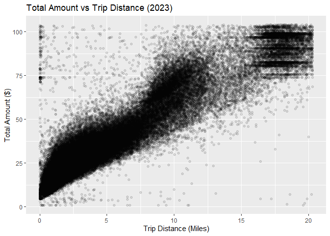
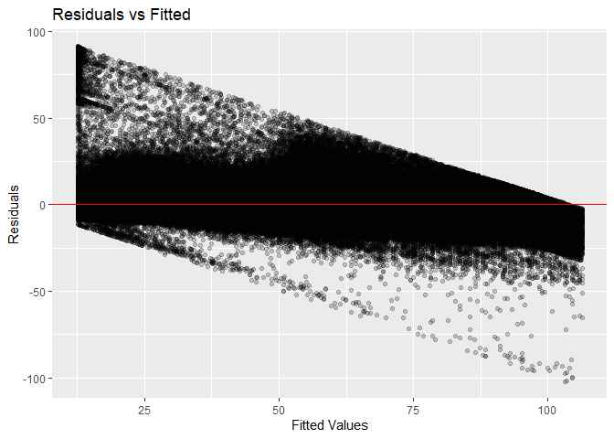
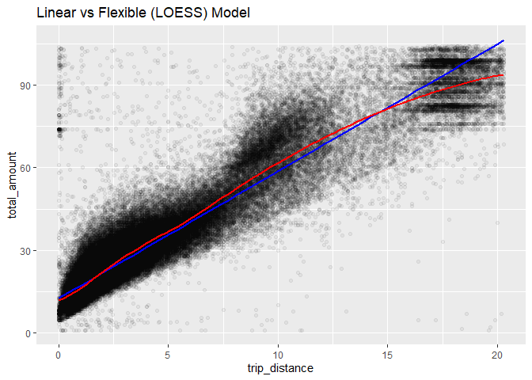
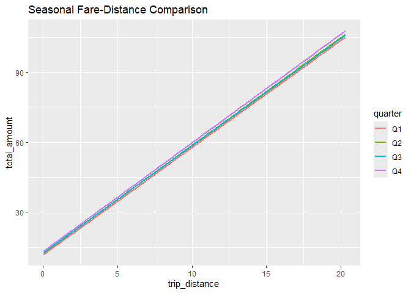

FA3 Espiritu, Clores
================
Espiritu, Joseph Raphael, Harneyyer, Clores
2026-02-22

``` r
library(arrow)
```

    ## 
    ## Attaching package: 'arrow'

    ## The following object is masked from 'package:utils':
    ## 
    ##     timestamp

``` r
library(tidyverse)
```

    ## ── Attaching core tidyverse packages ──────────────────────── tidyverse 2.0.0 ──
    ## ✔ dplyr     1.1.4     ✔ readr     2.1.5
    ## ✔ forcats   1.0.0     ✔ stringr   1.5.1
    ## ✔ ggplot2   3.5.2     ✔ tibble    3.2.1
    ## ✔ lubridate 1.9.4     ✔ tidyr     1.3.1
    ## ✔ purrr     1.0.4

    ## ── Conflicts ────────────────────────────────────────── tidyverse_conflicts() ──
    ## ✖ lubridate::duration() masks arrow::duration()
    ## ✖ dplyr::filter()       masks stats::filter()
    ## ✖ dplyr::lag()          masks stats::lag()
    ## ℹ Use the conflicted package (<http://conflicted.r-lib.org/>) to force all conflicts to become errors

``` r
library(broom)
library(modelr)
```

    ## 
    ## Attaching package: 'modelr'
    ## 
    ## The following object is masked from 'package:broom':
    ## 
    ##     bootstrap

``` r
library(robustbase)
library(lubridate)
library(purrr)
```

``` r
# ---------------------------------------
# 1️ Load parquet files (Full 2023 Data)
# ---------------------------------------

taxi <- open_dataset("data")

# ---------------------------------------
# 2️ Filter valid trips (Arrow stage)
# ---------------------------------------
taxi_clean <- taxi %>%
  filter(trip_distance > 0,
         total_amount > 0) %>%
  select(trip_distance,
         total_amount,
         tpep_pickup_datetime,
         tpep_dropoff_datetime) %>%
  collect()

# ---------------------------------------
# 3️ Create required variables (In memory)
# ---------------------------------------
taxi_clean <- taxi_clean %>%
  mutate(
    trip_duration_minutes =
      as.numeric(difftime(tpep_dropoff_datetime,
                          tpep_pickup_datetime,
                          units = "mins")),
    
    fare_per_mile =
      total_amount / trip_distance,
    
    month =
      factor(lubridate::month(tpep_pickup_datetime))
  )

# ---------------------------------------
# 4️ Remove extreme outliers (top 1%)
# ---------------------------------------
q_dist <- quantile(taxi_clean$trip_distance, 0.99)
q_fare <- quantile(taxi_clean$total_amount, 0.99)

taxi_trimmed <- taxi_clean %>%
  filter(trip_distance <= q_dist,
         total_amount <= q_fare)

# ---------------------------------------
# 5️ Create modeling sample (for speed)
# ---------------------------------------
set.seed(123)

taxi_model <- taxi_trimmed %>%
  sample_n(1300000)

# ---------------------------------------
# 6️ Summary statistics (on modeling data)
# ---------------------------------------
summary(taxi_model)
```

    ##  trip_distance     total_amount    tpep_pickup_datetime            
    ##  Min.   : 0.010   Min.   :  0.01   Min.   :2023-01-01 08:07:09.00  
    ##  1st Qu.: 1.090   1st Qu.: 15.96   1st Qu.:2023-04-02 07:23:52.75  
    ##  Median : 1.800   Median : 21.00   Median :2023-06-26 17:36:30.50  
    ##  Mean   : 3.236   Mean   : 27.49   Mean   :2023-07-02 11:41:02.08  
    ##  3rd Qu.: 3.330   3rd Qu.: 30.10   3rd Qu.:2023-10-06 10:47:27.75  
    ##  Max.   :20.300   Max.   :103.91   Max.   :2024-01-01 07:58:49.00  
    ##                                                                    
    ##  tpep_dropoff_datetime            trip_duration_minutes fare_per_mile      
    ##  Min.   :2023-01-01 08:13:59.00   Min.   : -54.35       Min.   :    0.003  
    ##  1st Qu.:2023-04-02 07:39:25.00   1st Qu.:   7.70       1st Qu.:    8.308  
    ##  Median :2023-06-26 17:55:08.50   Median :  12.58       Median :   11.392  
    ##  Mean   :2023-07-02 11:58:01.41   Mean   :  16.99       Mean   :   16.557  
    ##  3rd Qu.:2023-10-06 11:02:43.00   3rd Qu.:  20.20       3rd Qu.:   15.474  
    ##  Max.   :2024-01-01 08:17:07.00   Max.   :3714.67       Max.   :10380.000  
    ##                                                                            
    ##      month       
    ##  5      :118993  
    ##  10     :117392  
    ##  3      :116811  
    ##  12     :115542  
    ##  4      :113809  
    ##  6      :113588  
    ##  (Other):603865

``` r
# ---------------------------------------
# 7️ Scatterplot (use sample to avoid slow plotting)
# ---------------------------------------
ggplot(taxi_model,
       aes(trip_distance, total_amount)) +
  geom_point(alpha = 0.1) +
  labs(title = "Total Amount vs Trip Distance (2023)",
       x = "Trip Distance (Miles)",
       y = "Total Amount ($)")
```

<!-- -->

The majority of taxi trips are short-distance rides, resulting in a
right-skewed distribution for both trip distance and total fare. The
mean exceeding the median further confirms the presence of long-distance
extreme values.

The scatterplot reveals a strong positive relationship between trip
distance and total fare. As trip distance increases, total fare
increases consistently. However, the spread of total fare becomes wider
at larger distances. Additionally, horizontal clustering around higher
fare values suggests structured pricing patterns such as airport flat
fares.

``` r
lm_model <- lm(total_amount ~ trip_distance,
               data = taxi_model)

summary(lm_model)
```

    ## 
    ## Call:
    ## lm(formula = total_amount ~ trip_distance, data = taxi_model)
    ## 
    ## Residuals:
    ##      Min       1Q   Median       3Q      Max 
    ## -102.093   -3.213   -0.962    2.152   91.227 
    ## 
    ## Coefficients:
    ##                Estimate Std. Error t value Pr(>|t|)    
    ## (Intercept)   12.540186   0.007491    1674   <2e-16 ***
    ## trip_distance  4.620067   0.001482    3118   <2e-16 ***
    ## ---
    ## Signif. codes:  0 '***' 0.001 '**' 0.01 '*' 0.05 '.' 0.1 ' ' 1
    ## 
    ## Residual standard error: 6.562 on 1299998 degrees of freedom
    ## Multiple R-squared:  0.882,  Adjusted R-squared:  0.882 
    ## F-statistic: 9.72e+06 on 1 and 1299998 DF,  p-value: < 2.2e-16

``` r
coef(lm_model)
```

    ##   (Intercept) trip_distance 
    ##     12.540186      4.620067

``` r
summary(lm_model)$r.squared
```

    ## [1] 0.8820308

If slope ≈ 4.62:

For every additional mile traveled, total taxi fare increases by
approximately \$4.62 on average.

Intercept:

The intercept represents the predicted fare when distance is zero. This
approximates the base fare.

The model explains X% of the variation in total_amount using
trip_distance alone.

``` r
augment(lm_model) %>%
  ggplot(aes(.fitted, .resid)) +
  geom_point(alpha = 0.2) +
  geom_hline(yintercept = 0, color = "red") +
  labs(title = "Residuals vs Fitted",
       x = "Fitted Values",
       y = "Residuals")
```

<!-- -->

Linearity:

Relationship appears mostly linear.

Heteroskedasticity:

Residual spread increases at higher fitted values, indicating
non-constant variance.

``` r
taxi_loess <- taxi_model %>% sample_n(100000)

loess_model <- loess(total_amount ~ trip_distance,
                     data = taxi_loess,
                     span = 0.3)

ggplot(taxi_loess,
       aes(trip_distance, total_amount)) +
  geom_point(alpha = 0.05) +
  geom_smooth(method = "lm", color = "blue", se = FALSE) +
  geom_smooth(method = "loess", color = "red", se = FALSE) +
  labs(title = "Linear vs Flexible (LOESS) Model")
```

    ## `geom_smooth()` using formula = 'y ~ x'
    ## `geom_smooth()` using formula = 'y ~ x'

<!-- -->

``` r
lm_rmse <- rmse(lm_model, taxi_model)
loess_rmse <- rmse(loess_model, taxi_model)

lm_rmse
```

    ## [1] 6.561552

``` r
loess_rmse
```

    ## [1] 6.211192

If LOESS RMSE slightly smaller:

Flexible modeling captures mild curvature in fare pricing and improves
prediction accuracy.

``` r
taxi_model <- taxi_model %>%
  mutate(cooks = cooks.distance(lm_model))

top10 <- taxi_model %>%
  arrange(desc(cooks)) %>%
  slice(1:10)

top10
```

    ## # A tibble: 10 × 8
    ##    trip_distance total_amount tpep_pickup_datetime tpep_dropoff_datetime
    ##            <dbl>        <dbl> <dttm>               <dttm>               
    ##  1          19.7         2    2023-11-11 11:39:56  2023-11-11 12:17:25  
    ##  2          19.6         1    2023-06-04 03:16:46  2023-06-04 03:18:02  
    ##  3          19.9         4.5  2023-04-19 19:39:11  2023-04-19 19:39:28  
    ##  4          19.9         4.65 2023-07-15 07:01:22  2023-07-15 07:01:49  
    ##  5          19.6         5.5  2023-03-31 04:04:00  2023-03-31 04:04:05  
    ##  6          19.7         6.75 2023-03-17 04:50:06  2023-03-17 04:50:11  
    ##  7          19.8         9.5  2023-07-01 00:55:29  2023-07-01 00:56:08  
    ##  8          19.5         9.5  2023-02-01 01:27:03  2023-02-01 01:27:08  
    ##  9          19           4.5  2023-01-29 23:45:47  2023-01-29 23:45:54  
    ## 10          19.2         7.25 2023-04-25 07:59:32  2023-04-25 07:59:42  
    ## # ℹ 4 more variables: trip_duration_minutes <dbl>, fare_per_mile <dbl>,
    ## #   month <fct>, cooks <dbl>

``` r
robust_model <- lmrob(total_amount ~ trip_distance,
                      data = taxi_model)

coef(lm_model)
```

    ##   (Intercept) trip_distance 
    ##     12.540186      4.620067

``` r
coef(robust_model)
```

    ##   (Intercept) trip_distance 
    ##      11.42071       4.80151

``` r
predict(lm_model,
        data.frame(trip_distance = 80))
```

    ##        1 
    ## 382.1455

``` r
predict(robust_model,
        data.frame(trip_distance = 80))
```

    ##        1 
    ## 395.5415

If robust slope smaller:

OLS slope is inflated by extreme values. Robust regression downweights
outliers.

Interpret:

Robust model provides more conservative predictions at large distances.

``` r
taxi_model <- taxi_model %>%
  mutate(
    quarter = case_when(
      month %in% c("1","2","3") ~ "Q1",
      month %in% c("4","5","6") ~ "Q2",
      month %in% c("7","8","9") ~ "Q3",
      TRUE ~ "Q4"
    )
  )

quarter_slopes <- taxi_model %>%
  group_by(quarter) %>%
  nest() %>%
  mutate(
    model = map(data, ~ lm(total_amount ~ trip_distance, data = .x)),
    tidy  = map(model, tidy)
  ) %>%
  unnest(tidy)

quarter_slopes
```

    ## # A tibble: 8 × 8
    ## # Groups:   quarter [4]
    ##   quarter data     model  term          estimate std.error statistic p.value
    ##   <chr>   <list>   <list> <chr>            <dbl>     <dbl>     <dbl>   <dbl>
    ## 1 Q4      <tibble> <lm>   (Intercept)      13.2    0.0157       842.       0
    ## 2 Q4      <tibble> <lm>   trip_distance     4.68   0.00318     1472.       0
    ## 3 Q3      <tibble> <lm>   (Intercept)      12.6    0.0165       765.       0
    ## 4 Q3      <tibble> <lm>   trip_distance     4.58   0.00316     1451.       0
    ## 5 Q2      <tibble> <lm>   (Intercept)      12.5    0.0141       881.       0
    ## 6 Q2      <tibble> <lm>   trip_distance     4.62   0.00275     1680.       0
    ## 7 Q1      <tibble> <lm>   (Intercept)      11.9    0.0134       888.       0
    ## 8 Q1      <tibble> <lm>   trip_distance     4.60   0.00270     1701.       0

``` r
ggplot(taxi_model,
       aes(trip_distance,
           total_amount,
           color = quarter)) +
  geom_smooth(method = "lm", se = FALSE) +
  labs(title = "Seasonal Fare-Distance Comparison")
```

    ## `geom_smooth()` using formula = 'y ~ x'

<!-- -->

Differences in slopes across quarters suggest seasonal variation in
marginal fare pricing, potentially due to congestion, demand, or
operational adjustments.

Linear modeling is inadequate when the relationship between variables is
nonlinear or when error variance is not constant. In the taxi dataset,
while trip distance strongly predicts total fare, residual plots
indicate increasing variability at larger distances, violating
homoskedasticity assumptions. Flexible regression methods such as LOESS
allow the model to adapt locally and capture curvature that a single
linear slope cannot represent. Large urban datasets also contain extreme
values that disproportionately influence ordinary least squares because
OLS minimizes squared residuals. These influential observations can
distort slope estimates and predictions. Robust regression mitigates
this issue by down-weighting extreme residuals, resulting in more stable
parameter estimates. Combining classical, flexible, and robust
approaches provides a deeper understanding of fare dynamics and ensures
more reliable predictive performance.
