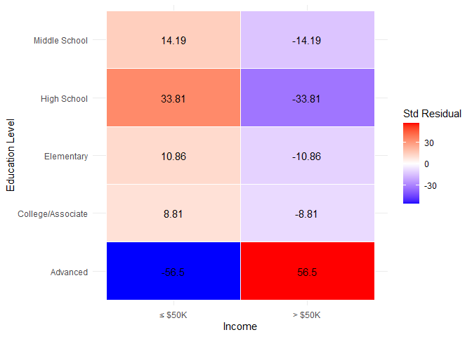

FA5 EDA
================
Espiritu, Joseph Raphael, Harneyyer, Clores
2026-04-16

## A. Data Preparation and Cleaning

### a. Import necessary libraries

### b. Load dataset correctly

### c. Assign column names (if needed)

### d. Recode education into 5 categories

### e. Handle missing values

``` r
# Load packages
library(tidyverse)
```

    ## ── Attaching core tidyverse packages ──────────────────────── tidyverse 2.0.0 ──
    ## ✔ dplyr     1.1.4     ✔ readr     2.1.6
    ## ✔ forcats   1.0.1     ✔ stringr   1.6.0
    ## ✔ ggplot2   4.0.1     ✔ tibble    3.3.0
    ## ✔ lubridate 1.9.4     ✔ tidyr     1.3.1
    ## ✔ purrr     1.2.0     
    ## ── Conflicts ────────────────────────────────────────── tidyverse_conflicts() ──
    ## ✖ dplyr::filter() masks stats::filter()
    ## ✖ dplyr::lag()    masks stats::lag()
    ## ℹ Use the conflicted package (<http://conflicted.r-lib.org/>) to force all conflicts to become errors

``` r
# Load dataset
df <- read_csv("adult.csv")
```

    ## Rows: 32561 Columns: 15
    ## ── Column specification ────────────────────────────────────────────────────────
    ## Delimiter: ","
    ## chr (9): workclass, education, marital.status, occupation, relationship, rac...
    ## dbl (6): age, fnlwgt, education.num, capital.gain, capital.loss, hours.per.week
    ## 
    ## ℹ Use `spec()` to retrieve the full column specification for this data.
    ## ℹ Specify the column types or set `show_col_types = FALSE` to quiet this message.

``` r
# Fix column names (if needed)
colnames(df) <- c(
  "age", "workclass", "fnlwgt", "education", "education_num",
  "marital_status", "occupation", "relationship", "race", "sex",
  "capital_gain", "capital_loss", "hours_per_week", "native_country", "income"
)

glimpse(df)
```

    ## Rows: 32,561
    ## Columns: 15
    ## $ age            <dbl> 90, 82, 66, 54, 41, 34, 38, 74, 68, 41, 45, 38, 52, 32,…
    ## $ workclass      <chr> "?", "Private", "?", "Private", "Private", "Private", "…
    ## $ fnlwgt         <dbl> 77053, 132870, 186061, 140359, 264663, 216864, 150601, …
    ## $ education      <chr> "HS-grad", "HS-grad", "Some-college", "7th-8th", "Some-…
    ## $ education_num  <dbl> 9, 9, 10, 4, 10, 9, 6, 16, 9, 10, 16, 15, 13, 14, 16, 1…
    ## $ marital_status <chr> "Widowed", "Widowed", "Widowed", "Divorced", "Separated…
    ## $ occupation     <chr> "?", "Exec-managerial", "?", "Machine-op-inspct", "Prof…
    ## $ relationship   <chr> "Not-in-family", "Not-in-family", "Unmarried", "Unmarri…
    ## $ race           <chr> "White", "White", "Black", "White", "White", "White", "…
    ## $ sex            <chr> "Female", "Female", "Female", "Female", "Female", "Fema…
    ## $ capital_gain   <dbl> 0, 0, 0, 0, 0, 0, 0, 0, 0, 0, 0, 0, 0, 0, 0, 0, 0, 0, 0…
    ## $ capital_loss   <dbl> 4356, 4356, 4356, 3900, 3900, 3770, 3770, 3683, 3683, 3…
    ## $ hours_per_week <dbl> 40, 18, 40, 40, 40, 45, 40, 20, 40, 60, 35, 45, 20, 55,…
    ## $ native_country <chr> "United-States", "United-States", "United-States", "Uni…
    ## $ income         <chr> "<=50K", "<=50K", "<=50K", "<=50K", "<=50K", "<=50K", "…

``` r
df <- df %>%
  mutate(across(where(is.character), ~na_if(., "?"))) %>%
  drop_na()

df <- df %>%
  mutate(
    education_grouped = case_when(
      education %in% c("Preschool", "1st-4th", "5th-6th") ~ "Elementary",
      education %in% c("7th-8th", "9th") ~ "Middle School",
      education %in% c("10th", "11th", "12th", "HS-grad") ~ "High School",
      education %in% c("Some-college", "Assoc-acdm", "Assoc-voc") ~ "College/Associate",
      education %in% c("Bachelors", "Masters", "Doctorate", "Prof-school") ~ "Advanced",
      TRUE ~ NA_character_
    )
  )

# Quick checks
glimpse(df)
```

    ## Rows: 30,162
    ## Columns: 16
    ## $ age               <dbl> 82, 54, 41, 34, 38, 74, 68, 45, 38, 52, 32, 46, 45, …
    ## $ workclass         <chr> "Private", "Private", "Private", "Private", "Private…
    ## $ fnlwgt            <dbl> 132870, 140359, 264663, 216864, 150601, 88638, 42201…
    ## $ education         <chr> "HS-grad", "7th-8th", "Some-college", "HS-grad", "10…
    ## $ education_num     <dbl> 9, 4, 10, 9, 6, 16, 9, 16, 15, 13, 14, 15, 7, 14, 13…
    ## $ marital_status    <chr> "Widowed", "Divorced", "Separated", "Divorced", "Sep…
    ## $ occupation        <chr> "Exec-managerial", "Machine-op-inspct", "Prof-specia…
    ## $ relationship      <chr> "Not-in-family", "Unmarried", "Own-child", "Unmarrie…
    ## $ race              <chr> "White", "White", "White", "White", "White", "White"…
    ## $ sex               <chr> "Female", "Female", "Female", "Female", "Male", "Fem…
    ## $ capital_gain      <dbl> 0, 0, 0, 0, 0, 0, 0, 0, 0, 0, 0, 0, 0, 0, 0, 0, 0, 0…
    ## $ capital_loss      <dbl> 4356, 3900, 3900, 3770, 3770, 3683, 3683, 3004, 2824…
    ## $ hours_per_week    <dbl> 18, 40, 40, 45, 40, 20, 40, 35, 45, 20, 55, 40, 76, …
    ## $ native_country    <chr> "United-States", "United-States", "United-States", "…
    ## $ income            <chr> "<=50K", "<=50K", "<=50K", "<=50K", "<=50K", ">50K",…
    ## $ education_grouped <chr> "High School", "Middle School", "College/Associate",…

``` r
table(df$education_grouped)
```

    ## 
    ##          Advanced College/Associate        Elementary       High School 
    ##              7588              8993               484             12085 
    ##     Middle School 
    ##              1012

``` r
sum(is.na(df$education_grouped))
```

    ## [1] 0

## B. Contingency Table Construction

### a. Create contingency table using education_grouped vs income

### b. Add totals

### c. Compute row percentages

### d. Present in APA format

``` r
# Contingency table (education_grouped vs income)
table_counts <- table(df$education_grouped, df$income)
table_counts
```

    ##                    
    ##                     <=50K  >50K
    ##   Advanced           3858  3730
    ##   College/Associate  7057  1936
    ##   Elementary          466    18
    ##   High School       10321  1764
    ##   Middle School       952    60

``` r
# Add row and column totals
table_with_totals <- addmargins(table_counts)
table_with_totals
```

    ##                    
    ##                     <=50K  >50K   Sum
    ##   Advanced           3858  3730  7588
    ##   College/Associate  7057  1936  8993
    ##   Elementary          466    18   484
    ##   High School       10321  1764 12085
    ##   Middle School       952    60  1012
    ##   Sum               22654  7508 30162

``` r
# Row percentages
row_percent <- prop.table(table_counts, margin = 1) * 100
round(row_percent, 2)
```

    ##                    
    ##                     <=50K  >50K
    ##   Advanced          50.84 49.16
    ##   College/Associate 78.47 21.53
    ##   Elementary        96.28  3.72
    ##   High School       85.40 14.60
    ##   Middle School     94.07  5.93

``` r
library(knitr)

# Row percentages
apa_percent <- round(prop.table(table_counts, 1) * 100, 1)

# Combine counts + percentages
combined <- matrix(
  paste0(table_counts, " (", apa_percent, "%)"),
  nrow = nrow(table_counts),
  dimnames = dimnames(table_counts)
)

combined_df <- as.data.frame.matrix(combined)
```

``` r
colnames(combined_df) <- c("≤ $50K", "> $50K")
kable(combined_df)
```

**Table 1**  
*Contingency Table of Education Level and Income*

|                   | ≤ \$50K       | \> \$50K     |
|:------------------|:--------------|:-------------|
| Advanced          | 3858 (50.8%)  | 3730 (49.2%) |
| College/Associate | 7057 (78.5%)  | 1936 (21.5%) |
| Elementary        | 466 (96.3%)   | 18 (3.7%)    |
| High School       | 10321 (85.4%) | 1764 (14.6%) |
| Middle School     | 952 (94.1%)   | 60 (5.9%)    |

## C. Chi-Square Test of Independence

### a. Perform chi-square test

### b. Report results

- Chi-square statistic  
- Degrees of freedom  
- p-value  
  \### c. State significance

``` r
chi_test <- chisq.test(table_counts)
chi_test
```

    ## 
    ##  Pearson's Chi-squared test
    ## 
    ## data:  table_counts
    ## X-squared = 3439.9, df = 4, p-value < 2.2e-16

``` r
chi_test$statistic   # Chi-square statistic
```

    ## X-squared 
    ##  3439.878

``` r
chi_test$parameter   # Degrees of freedom
```

    ## df 
    ##  4

``` r
chi_test$p.value     # p-value
```

    ## [1] 0

## D. Expected Frequencies & Residuals

### a. Compute expected frequencies

### b. Compute standardized residuals

### c. Present results in table form

``` r
expected <- round(chi_test$expected, 2)
expected
```

    ##                    
    ##                       <=50K    >50K
    ##   Advanced          5699.18 1888.82
    ##   College/Associate 6754.44 2238.56
    ##   Elementary         363.52  120.48
    ##   High School       9076.77 3008.23
    ##   Middle School      760.09  251.91

``` r
residuals <- round(chi_test$stdres, 2)
residuals
```

    ##                    
    ##                      <=50K   >50K
    ##   Advanced          -56.50  56.50
    ##   College/Associate   8.81  -8.81
    ##   Elementary         10.86 -10.86
    ##   High School        33.81 -33.81
    ##   Middle School      14.19 -14.19

``` r
colnames(expected) <- c("≤ $50K", "> $50K")
kable(expected)
colnames(residuals) <- c("≤ $50K", "> $50K")
kable(residuals)
```

**Table 2**  
*Expected Frequencies for Education Level and Income*

|                   | ≤ \$50K | \> \$50K |
|:------------------|--------:|---------:|
| Advanced          | 5699.18 |  1888.82 |
| College/Associate | 6754.44 |  2238.56 |
| Elementary        |  363.52 |   120.48 |
| High School       | 9076.77 |  3008.23 |
| Middle School     |  760.09 |   251.91 |

*Note.* Expected counts assuming independence between education level
and income.

**Table 3**  
*Standardized Residuals for Education Level and Income*

|                   | ≤ \$50K | \> \$50K |
|:------------------|--------:|---------:|
| Advanced          |  -56.50 |    56.50 |
| College/Associate |    8.81 |    -8.81 |
| Elementary        |   10.86 |   -10.86 |
| High School       |   33.81 |   -33.81 |
| Middle School     |   14.19 |   -14.19 |

*Note.* Residuals with absolute values greater than 1.96 indicate
statistically significant deviations from expected frequencies.

## E. Data Visualization

### a. Create heatmap of residuals

### b. Apply proper color scaling and labels

### c. Add annotations

### d. Include APA-style figure title and note

``` r
library(ggplot2)

# Convert residuals to long format
res_long <- as.data.frame(as.table(residuals))

# Heatmap
plotheat <- ggplot(res_long, aes(x = Var2, y = Var1, fill = Freq)) +
  geom_tile(color = "white") +
  geom_text(aes(label = round(Freq, 2))) +
  scale_fill_gradient2(
    low = "blue",
    mid = "white",
    high = "red",
    midpoint = 0
  ) +
  labs(
    x = "Income",
    y = "Education Level",
    fill = "Std Residual"
  ) +
  theme_minimal()
```

``` r
plotheat
```

**Figure 1**  
*Heatmap of Standardized Residuals for Education Level and Income*

<!-- -->

*Note.* Red cells indicate higher-than-expected frequencies, while blue
cells indicate lower-than-expected frequencies. Values greater than
±1.96 are statistically significant.

## F. Interpretation and Insights

### a. Interpret chi-square results

### **Interpretation and Significance**

A chi-square test of independence was conducted to examine whether there
is a relationship between **education level** and **income category**.

The results showed a **statistically significant association** between
education level and income,  
**χ²(4) = 3439.88, *p* \< .001**.

Since the p-value is far below the conventional significance level of
0.05, we **reject the null hypothesis**, which stated that education
level and income are independent. This indicates that there is strong
statistical evidence of a relationship between the two variables.

The magnitude of the chi-square statistic is very large, suggesting that
the observed differences between education groups are substantial and
unlikely to have occurred by random chance. In practical terms, this
means that income distribution varies significantly depending on
education level.

Specifically, individuals with higher levels of education are more
likely to fall into the higher income category (**\>50K**), while
individuals with lower levels of education are disproportionately
represented in the lower income category (**≤50K**). This pattern
reflects a meaningful real-world relationship in which increased
educational attainment is associated with higher earning potential.

Overall, the findings demonstrate that **education level is a
significant factor influencing income**, and the association between
these variables is both statistically significant and practically
meaningful.

### b. Identify significant residuals (\|z\| \> 1.96)

### **Interpretation of Expected Frequencies and Standardized Residuals**

The expected frequencies represent the counts that would be anticipated
if there were no association between education level and income. A
comparison between the observed and expected frequencies reveals notable
deviations across several education groups.

To further examine these differences, standardized residuals were
analyzed. Residual values greater than **±1.96** indicate statistically
significant deviations from the expected counts.

The results show several large residual values, indicating strong
deviations from independence:

- The **Advanced education group** shows a very large **negative
  residual (-56.50)** in the ≤50K category and a corresponding
  **positive residual (56.50)** in the \>50K category. This indicates
  that significantly fewer individuals than expected earn ≤50K, and
  significantly more individuals than expected earn \>50K in this group.

- The **High School group** also shows substantial deviations, with a
  large **positive residual (33.81)** in the ≤50K category and a
  **negative residual (-33.81)** in the \>50K category. This suggests
  that individuals in this group are significantly overrepresented in
  the lower income category.

- The **Middle School and Elementary groups** display similar patterns,
  with positive residuals in ≤50K and negative residuals in \>50K,
  indicating that these groups are strongly associated with lower income
  levels.

- The **College/Associate group** shows moderate but still statistically
  significant residuals, suggesting a transitional pattern between lower
  and higher income distributions.

Overall, these residual patterns confirm that the significant chi-square
result is driven by clear and systematic differences in income
distribution across education levels. Higher education levels are
associated with higher-than-expected representation in the \>50K
category, while lower education levels are associated with
higher-than-expected representation in the ≤50K category.

These findings reinforce the conclusion that **education level plays a
critical role in shaping income outcomes**, and the relationship
observed is both statistically significant and substantively meaningful.

### c. Provide 2–3 key insights

### **Key Insights**

1.  **The relationship between education and income is both highly
    uneven and strongly driven by specific groups.**  
    The exceptionally large residuals observed in the Advanced (±56.50)
    and High School (±33.81) categories indicate that these groups
    contribute disproportionately to the overall chi-square statistic.
    This demonstrates that the association is not uniformly distributed
    across all education levels but is instead dominated by certain
    groups with pronounced deviations from expected income patterns.

2.  **Education creates a structured and directional shift in income
    distribution, reflecting clear socioeconomic stratification.**  
    Higher education levels are strongly associated with
    overrepresentation in the \>50K income category, while lower
    education levels are concentrated in the ≤50K category. This
    consistent and mirrored pattern across groups indicates a
    systematic, non-random relationship in which education functions as
    a key factor separating individuals into distinct income segments.

3.  **The magnitude and pattern of residuals indicate a meaningful
    real-world effect, with a gradual transition across education
    levels.**  
    The large residual values suggest that the relationship is not only
    statistically significant but also practically substantial.
    Additionally, intermediate groups such as College/Associate show
    moderate residuals, indicating a transition zone rather than a
    strict divide, where education incrementally increases the
    likelihood of higher income rather than guaranteeing it.
