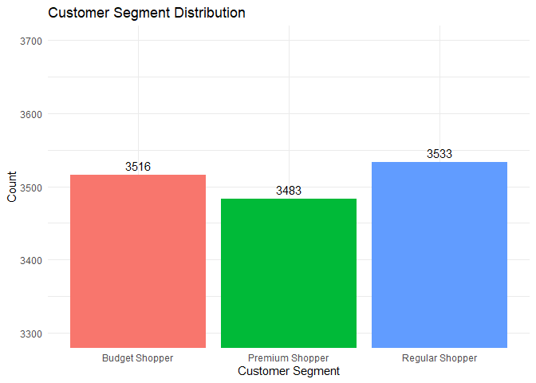
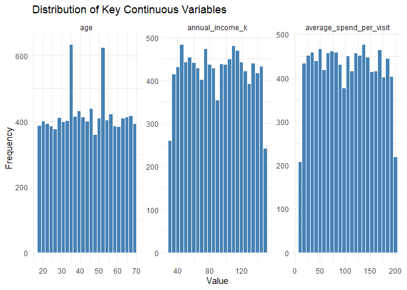
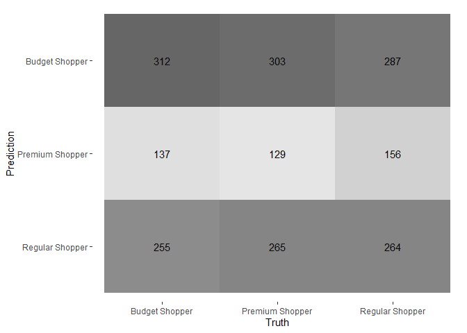
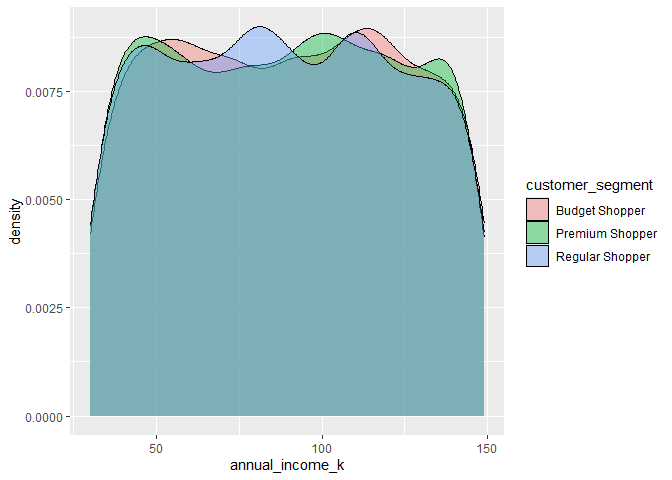
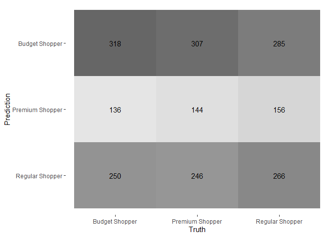

FA6
================
Espiritu, Joseph Raphael
2026-05-01

``` r
# Install if needed
# install.packages(c("tidyverse","tidymodels","nnet","GGally"))

library(tidyverse)
```

    ## ── Attaching core tidyverse packages ──────────────────────── tidyverse 2.0.0 ──
    ## ✔ dplyr     1.2.1     ✔ readr     2.2.0
    ## ✔ forcats   1.0.1     ✔ stringr   1.6.0
    ## ✔ ggplot2   4.0.3     ✔ tibble    3.3.1
    ## ✔ lubridate 1.9.5     ✔ tidyr     1.3.2
    ## ✔ purrr     1.2.2     
    ## ── Conflicts ────────────────────────────────────────── tidyverse_conflicts() ──
    ## ✖ dplyr::filter() masks stats::filter()
    ## ✖ dplyr::lag()    masks stats::lag()
    ## ℹ Use the conflicted package (<http://conflicted.r-lib.org/>) to force all conflicts to become errors

``` r
library(tidymodels)
```

    ## ── Attaching packages ────────────────────────────────────── tidymodels 1.5.0 ──
    ## ✔ broom        1.0.12     ✔ rsample      1.3.2 
    ## ✔ dials        1.4.3      ✔ tailor       0.1.0 
    ## ✔ infer        1.1.0      ✔ tune         2.1.0 
    ## ✔ modeldata    1.5.1      ✔ workflows    1.3.0 
    ## ✔ parsnip      1.5.0      ✔ workflowsets 1.1.1 
    ## ✔ recipes      1.3.2      ✔ yardstick    1.4.0 
    ## ── Conflicts ───────────────────────────────────────── tidymodels_conflicts() ──
    ## ✖ scales::discard() masks purrr::discard()
    ## ✖ dplyr::filter()   masks stats::filter()
    ## ✖ recipes::fixed()  masks stringr::fixed()
    ## ✖ dplyr::lag()      masks stats::lag()
    ## ✖ yardstick::spec() masks readr::spec()
    ## ✖ recipes::step()   masks stats::step()

``` r
library(janitor)
```

    ## 
    ## Attaching package: 'janitor'
    ## 
    ## The following objects are masked from 'package:stats':
    ## 
    ##     chisq.test, fisher.test

``` r
# Load dataset
df <- read_csv("customer_segmentation.csv")
```

    ## Rows: 10532 Columns: 8
    ## ── Column specification ────────────────────────────────────────────────────────
    ## Delimiter: ","
    ## chr (3): Gender, Product Category Purchased, Customer Segment
    ## dbl (5): Customer ID, Age, Annual Income (K$), Average Spend per Visit ($), ...
    ## 
    ## ℹ Use `spec()` to retrieve the full column specification for this data.
    ## ℹ Specify the column types or set `show_col_types = FALSE` to quiet this message.

``` r
df <- df %>%
  clean_names()
# Preview
colnames(df)
```

    ## [1] "customer_id"                       "age"                              
    ## [3] "annual_income_k"                   "gender"                           
    ## [5] "product_category_purchased"        "average_spend_per_visit"          
    ## [7] "number_of_visits_in_last_6_months" "customer_segment"

``` r
glimpse(df)
```

    ## Rows: 10,532
    ## Columns: 8
    ## $ customer_id                       <dbl> 1, 2, 3, 4, 5, 6, 7, 8, 9, 10, 11, 1…
    ## $ age                               <dbl> 56, 69, 46, 32, 60, 25, 38, 56, 36, …
    ## $ annual_income_k                   <dbl> 106, 66, 110, 50, 73, 48, 100, 131, …
    ## $ gender                            <chr> "Female", "Female", "Male", "Male", …
    ## $ product_category_purchased        <chr> "Fashion", "Home", "Fashion", "Elect…
    ## $ average_spend_per_visit           <dbl> 163.45276, 163.02050, 104.54128, 110…
    ## $ number_of_visits_in_last_6_months <dbl> 16, 31, 29, 26, 38, 22, 20, 33, 34, …
    ## $ customer_segment                  <chr> "Premium Shopper", "Budget Shopper",…

``` r
str(df)
```

    ## spc_tbl_ [10,532 × 8] (S3: spec_tbl_df/tbl_df/tbl/data.frame)
    ##  $ customer_id                      : num [1:10532] 1 2 3 4 5 6 7 8 9 10 ...
    ##  $ age                              : num [1:10532] 56 69 46 32 60 25 38 56 36 40 ...
    ##  $ annual_income_k                  : num [1:10532] 106 66 110 50 73 48 100 131 37 106 ...
    ##  $ gender                           : chr [1:10532] "Female" "Female" "Male" "Male" ...
    ##  $ product_category_purchased       : chr [1:10532] "Fashion" "Home" "Fashion" "Electronics" ...
    ##  $ average_spend_per_visit          : num [1:10532] 163 163 105 110 142 ...
    ##  $ number_of_visits_in_last_6_months: num [1:10532] 16 31 29 26 38 22 20 33 34 34 ...
    ##  $ customer_segment                 : chr [1:10532] "Premium Shopper" "Budget Shopper" "Budget Shopper" "Regular Shopper" ...
    ##  - attr(*, "spec")=
    ##   .. cols(
    ##   ..   `Customer ID` = col_double(),
    ##   ..   Age = col_double(),
    ##   ..   `Annual Income (K$)` = col_double(),
    ##   ..   Gender = col_character(),
    ##   ..   `Product Category Purchased` = col_character(),
    ##   ..   `Average Spend per Visit ($)` = col_double(),
    ##   ..   `Number of Visits in Last 6 Months` = col_double(),
    ##   ..   `Customer Segment` = col_character()
    ##   .. )
    ##  - attr(*, "problems")=<externalptr>

### Data Exploration:

``` r
#Missing Values
df %>%
  summarise(across(everything(), ~sum(is.na(.)))) %>%
  pivot_longer(everything(), names_to = "Variable", values_to = "Missing_Count")
```

    ## # A tibble: 8 × 2
    ##   Variable                          Missing_Count
    ##   <chr>                                     <int>
    ## 1 customer_id                                   0
    ## 2 age                                           0
    ## 3 annual_income_k                               0
    ## 4 gender                                        0
    ## 5 product_category_purchased                    0
    ## 6 average_spend_per_visit                       0
    ## 7 number_of_visits_in_last_6_months             0
    ## 8 customer_segment                              0

``` r
# Target Dist

df %>%
  count(customer_segment) %>%
  ggplot(aes(x = customer_segment, y = n, fill = customer_segment)) +
  geom_col() +
  geom_text(aes(label = n), vjust = -0.5) +
  coord_cartesian(ylim = c(3300, 3700)) +
  labs(
    title = "Customer Segment Distribution",
    x = "Customer Segment",
    y = "Count"
  ) +
  theme_minimal() +
  theme(legend.position = "none")
```

<!-- -->

``` r
# Dist
df %>%
  pivot_longer(c(age, annual_income_k, average_spend_per_visit)) %>%
  ggplot(aes(x = value)) +
  geom_histogram(bins = 25, fill = "steelblue", color = "white") +
  facet_wrap(~name, scales = "free") +
  labs(
    title = "Distribution of Key Continuous Variables",
    x = "Value",
    y = "Frequency"
  ) +
  theme_minimal()
```

<!-- -->

``` r
ggplot(df, aes(x = annual_income_k, fill = customer_segment)) +
  geom_density(alpha = 0.4)
```

<!-- -->

``` r
df %>%
  group_by(customer_segment) %>%
  summarise(
    mean_income = mean(annual_income_k),
    mean_spend = mean(average_spend_per_visit)
  )
```

    ## # A tibble: 3 × 3
    ##   customer_segment mean_income mean_spend
    ##   <chr>                  <dbl>      <dbl>
    ## 1 Budget Shopper          89.5       105.
    ## 2 Premium Shopper         89.2       104.
    ## 3 Regular Shopper         88.9       103.

``` r
cor(df %>% select(age, annual_income_k, average_spend_per_visit))
```

    ##                                   age annual_income_k average_spend_per_visit
    ## age                      1.0000000000   -0.0002715857            0.0002578901
    ## annual_income_k         -0.0002715857    1.0000000000            0.0049846146
    ## average_spend_per_visit  0.0002578901    0.0049846146            1.0000000000

### Data Preprocessing:

``` r
# Convert categorical variables into factors so R treats them as categories
df <- df %>%
  mutate(
    customer_segment = factor(customer_segment),
    gender = factor(gender),
    product_category_purchased = factor(product_category_purchased)
  )

# Display structure of the dataset to verify variable types
str(df)
```

    ## tibble [10,532 × 8] (S3: tbl_df/tbl/data.frame)
    ##  $ customer_id                      : num [1:10532] 1 2 3 4 5 6 7 8 9 10 ...
    ##  $ age                              : num [1:10532] 56 69 46 32 60 25 38 56 36 40 ...
    ##  $ annual_income_k                  : num [1:10532] 106 66 110 50 73 48 100 131 37 106 ...
    ##  $ gender                           : Factor w/ 2 levels "Female","Male": 1 1 2 2 1 2 2 2 1 1 ...
    ##  $ product_category_purchased       : Factor w/ 5 levels "Books","Electronics",..: 3 4 3 2 5 4 2 1 1 3 ...
    ##  $ average_spend_per_visit          : num [1:10532] 163 163 105 110 142 ...
    ##  $ number_of_visits_in_last_6_months: num [1:10532] 16 31 29 26 38 22 20 33 34 34 ...
    ##  $ customer_segment                 : Factor w/ 3 levels "Budget Shopper",..: 2 1 1 3 3 1 1 1 2 1 ...

``` r
# Set seed for reproducibility so splits are consistent across runs
set.seed(123)


# Split data into 80% training and 20% testing while preserving class distribution
split <- initial_split(df, prop = 0.8, strata = customer_segment)

# Extract training dataset
train <- training(split)

# Extract testing dataset
test  <- testing(split)

# Check total number of rows in original dataset
nrow(df)
```

    ## [1] 10532

``` r
# Check number of rows in training set
nrow(train)
```

    ## [1] 8424

``` r
# Check number of rows in testing set
nrow(test)
```

    ## [1] 2108

``` r
# Verify class distribution in training set
train %>% count(customer_segment)
```

    ## # A tibble: 3 × 2
    ##   customer_segment     n
    ##   <fct>            <int>
    ## 1 Budget Shopper    2812
    ## 2 Premium Shopper   2786
    ## 3 Regular Shopper   2826

``` r
# Verify class distribution in testing set
test %>% count(customer_segment)
```

    ## # A tibble: 3 × 2
    ##   customer_segment     n
    ##   <fct>            <int>
    ## 1 Budget Shopper     704
    ## 2 Premium Shopper    697
    ## 3 Regular Shopper    707

``` r
rec <- recipe(customer_segment ~ ., data = train) %>%
  update_role(customer_id, new_role = "id") %>%
  step_dummy(all_nominal_predictors()) %>%
  step_normalize(all_numeric_predictors())

# Create preprocessing recipe defining transformations for modeling
rec <- recipe(customer_segment ~ ., data = train) %>%
  update_role(customer_id, new_role = "id") %>%   # Mark ID column so it is not used as a predictor
  step_dummy(all_nominal_predictors()) %>%        # Convert categorical predictors into dummy variables
  step_normalize(all_numeric_predictors())        # Scale numeric predictors to mean 0 and standard deviation 1

# Print recipe structure to review preprocessing steps
rec
```

    ## 

    ## ── Recipe ──────────────────────────────────────────────────────────────────────

    ## 

    ## ── Inputs

    ## Number of variables by role

    ## outcome:   1
    ## predictor: 6
    ## id:        1

    ## 

    ## ── Operations

    ## • Dummy variables from: all_nominal_predictors()

    ## • Centering and scaling for: all_numeric_predictors()

``` r
# Summarize variables, roles, and types in the recipe
summary(rec)
```

    ## # A tibble: 8 × 4
    ##   variable                          type      role      source  
    ##   <chr>                             <list>    <chr>     <chr>   
    ## 1 customer_id                       <chr [2]> id        original
    ## 2 age                               <chr [2]> predictor original
    ## 3 annual_income_k                   <chr [2]> predictor original
    ## 4 gender                            <chr [3]> predictor original
    ## 5 product_category_purchased        <chr [3]> predictor original
    ## 6 average_spend_per_visit           <chr [2]> predictor original
    ## 7 number_of_visits_in_last_6_months <chr [2]> predictor original
    ## 8 customer_segment                  <chr [3]> outcome   original

``` r
# Prepare the recipe by estimating required parameters (means, SDs, levels)
prep_rec <- prep(rec)

# Apply preprocessing transformations to training data
train_processed <- bake(prep_rec, new_data = train)

# Apply same transformations to testing data
test_processed  <- bake(prep_rec, new_data = test)

# Remove customer_id column since it should not be used in modeling
train_processed <- train_processed %>%
  select(-customer_id)

# Remove customer_id from testing data as well
test_processed <- test_processed %>%
  select(-customer_id)

# Inspect structure of processed training data to confirm transformations
glimpse(train_processed)
```

    ## Rows: 8,424
    ## Columns: 10
    ## $ age                                    <dbl> 1.7056472, 0.1610942, -0.376141…
    ## $ annual_income_k                        <dbl> -0.66830903, 0.61170147, 0.3207…
    ## $ average_spend_per_visit                <dbl> 1.08613737, 0.01219885, -0.2688…
    ## $ number_of_visits_in_last_6_months      <dbl> 0.9027429, 0.7034790, -0.193208…
    ## $ customer_segment                       <fct> Budget Shopper, Budget Shopper,…
    ## $ gender_Male                            <dbl> -0.989314, 1.010681, 1.010681, …
    ## $ product_category_purchased_Electronics <dbl> -0.4895984, -0.4895984, 2.04224…
    ## $ product_category_purchased_Fashion     <dbl> -0.4838152, 2.0666597, -0.48381…
    ## $ product_category_purchased_Home        <dbl> 2.0124311, -0.4968524, -0.49685…
    ## $ product_category_purchased_Others      <dbl> -0.5271429, -0.5271429, -0.5271…

``` r
# Check if customer_id column was successfully removed
"customer_id" %in% colnames(train_processed)
```

    ## [1] FALSE

``` r
# Check summary statistics of scaled age variable (should be centered around 0)
summary(train_processed$age)
```

    ##     Min.  1st Qu.   Median     Mean  3rd Qu.     Max. 
    ## -1.71923 -0.84622 -0.04037  0.00000  0.83264  1.70565

``` r
# View column names to confirm dummy variables and processed features
colnames(train_processed)
```

    ##  [1] "age"                                   
    ##  [2] "annual_income_k"                       
    ##  [3] "average_spend_per_visit"               
    ##  [4] "number_of_visits_in_last_6_months"     
    ##  [5] "customer_segment"                      
    ##  [6] "gender_Male"                           
    ##  [7] "product_category_purchased_Electronics"
    ##  [8] "product_category_purchased_Fashion"    
    ##  [9] "product_category_purchased_Home"       
    ## [10] "product_category_purchased_Others"

``` r
# Check for any remaining missing values in processed data
colSums(is.na(train_processed))
```

    ##                                    age                        annual_income_k 
    ##                                      0                                      0 
    ##                average_spend_per_visit      number_of_visits_in_last_6_months 
    ##                                      0                                      0 
    ##                       customer_segment                            gender_Male 
    ##                                      0                                      0 
    ## product_category_purchased_Electronics     product_category_purchased_Fashion 
    ##                                      0                                      0 
    ##        product_category_purchased_Home      product_category_purchased_Others 
    ##                                      0                                      0

``` r
# Confirm target variable remains a factor after preprocessing
class(train_processed$customer_segment)
```

    ## [1] "factor"

### Model Building:

``` r
# Define a multinomial logistic regression model with no regularization (baseline model)
model <- multinom_reg(penalty = 0, mixture = 0) %>%
  set_engine("nnet") %>%                     # Use nnet as the underlying algorithm
  set_mode("classification")                # Specify classification task

# Create a workflow combining preprocessing (recipe) and the model
wf <- workflow() %>%
  add_recipe(rec) %>%                       # Attach preprocessing steps
  add_model(model)                          # Attach model

# View workflow structure
wf
```

    ## ══ Workflow ════════════════════════════════════════════════════════════════════
    ## Preprocessor: Recipe
    ## Model: multinom_reg()
    ## 
    ## ── Preprocessor ────────────────────────────────────────────────────────────────
    ## 2 Recipe Steps
    ## 
    ## • step_dummy()
    ## • step_normalize()
    ## 
    ## ── Model ───────────────────────────────────────────────────────────────────────
    ## Multinomial Regression Model Specification (classification)
    ## 
    ## Main Arguments:
    ##   penalty = 0
    ##   mixture = 0
    ## 
    ## Computational engine: nnet

``` r
# Fit the model using training data (recipe is applied internally)
fit_model <- fit(wf, data = train)

# View fitted model details
fit_model
```

    ## ══ Workflow [trained] ══════════════════════════════════════════════════════════
    ## Preprocessor: Recipe
    ## Model: multinom_reg()
    ## 
    ## ── Preprocessor ────────────────────────────────────────────────────────────────
    ## 2 Recipe Steps
    ## 
    ## • step_dummy()
    ## • step_normalize()
    ## 
    ## ── Model ───────────────────────────────────────────────────────────────────────
    ## Call:
    ## nnet::multinom(formula = ..y ~ ., data = data, decay = ~0, trace = FALSE)
    ## 
    ## Coefficients:
    ##                  (Intercept)        age annual_income_k average_spend_per_visit
    ## Premium Shopper -0.007826136 0.02056495     -0.02037387              -0.0309838
    ## Regular Shopper  0.005959936 0.02356896     -0.03982520              -0.0385606
    ##                 number_of_visits_in_last_6_months gender_Male
    ## Premium Shopper                       -0.01024803 -0.02288348
    ## Regular Shopper                       -0.01120255 -0.04319152
    ##                 product_category_purchased_Electronics
    ## Premium Shopper                             0.04897896
    ## Regular Shopper                             0.04277732
    ##                 product_category_purchased_Fashion
    ## Premium Shopper                         0.09555953
    ## Regular Shopper                         0.07594933
    ##                 product_category_purchased_Home
    ## Premium Shopper                      0.05997727
    ## Regular Shopper                      0.03376563
    ##                 product_category_purchased_Others
    ## Premium Shopper                        0.06261410
    ## Regular Shopper                        0.07911232
    ## 
    ## Residual Deviance: 18489.02 
    ## AIC: 18529.02

``` r
# Generate predicted class labels for test data
pred_class <- predict(fit_model, test)

# Generate predicted probabilities for each class
pred_prob <- predict(fit_model, test, type = "prob")

# Combine test data, predicted class, and probabilities into one dataset
pred <- bind_cols(test, pred_class, pred_prob)

# View final prediction dataset
pred
```

    ## # A tibble: 2,108 × 12
    ##    customer_id   age annual_income_k gender product_category_purchased
    ##          <dbl> <dbl>           <dbl> <fct>  <fct>                     
    ##  1           6    25              48 Male   Home                      
    ##  2          13    41              70 Female Home                      
    ##  3          16    41              99 Male   Home                      
    ##  4          23    55             136 Female Books                     
    ##  5          27    29              95 Female Books                     
    ##  6          28    39              48 Male   Home                      
    ##  7          36    32             121 Male   Home                      
    ##  8          38    68             100 Male   Electronics               
    ##  9          44    24              35 Female Home                      
    ## 10          45    38              47 Female Home                      
    ## # ℹ 2,098 more rows
    ## # ℹ 7 more variables: average_spend_per_visit <dbl>,
    ## #   number_of_visits_in_last_6_months <dbl>, customer_segment <fct>,
    ## #   .pred_class <fct>, `.pred_Budget Shopper` <dbl>,
    ## #   `.pred_Premium Shopper` <dbl>, `.pred_Regular Shopper` <dbl>

``` r
# View column names for the predcition dataset
colnames(pred)
```

    ##  [1] "customer_id"                       "age"                              
    ##  [3] "annual_income_k"                   "gender"                           
    ##  [5] "product_category_purchased"        "average_spend_per_visit"          
    ##  [7] "number_of_visits_in_last_6_months" "customer_segment"                 
    ##  [9] ".pred_class"                       ".pred_Budget Shopper"             
    ## [11] ".pred_Premium Shopper"             ".pred_Regular Shopper"

### Model Evaluation:

``` r
# Compute overall performance metrics such as accuracy, precision, recall, and F1-score
metrics(pred, truth = customer_segment, estimate = .pred_class)
```

    ## # A tibble: 2 × 3
    ##   .metric  .estimator .estimate
    ##   <chr>    <chr>          <dbl>
    ## 1 accuracy multiclass    0.345 
    ## 2 kap      multiclass    0.0166

``` r
# Create a confusion matrix comparing predicted classes to actual classes
cm <- conf_mat(pred, truth = customer_segment, estimate = .pred_class)

# Display the confusion matrix in table form to observe correct and incorrect classifications
cm
```

    ##                  Truth
    ## Prediction        Budget Shopper Premium Shopper Regular Shopper
    ##   Budget Shopper             317             307             285
    ##   Premium Shopper            136             144             156
    ##   Regular Shopper            251             246             266

``` r
# Visualize the confusion matrix as a heatmap for easier interpretation of classification patterns
autoplot(cm, type = "heatmap")
```

<!-- -->

``` r
# Recompute performance metrics (useful if you want to explicitly display results again)
metrics(pred, truth = customer_segment, estimate = .pred_class)
```

    ## # A tibble: 2 × 3
    ##   .metric  .estimator .estimate
    ##   <chr>    <chr>          <dbl>
    ## 1 accuracy multiclass    0.345 
    ## 2 kap      multiclass    0.0166

``` r
# Compute multinomial log-loss using predicted probabilities for each class
mn_log_loss(
  pred,
  truth = customer_segment,
  `.pred_Budget Shopper`,     # Probability of Budget Shopper
  `.pred_Premium Shopper`,    # Probability of Premium Shopper
  `.pred_Regular Shopper`     # Probability of Regular Shopper
)
```

    ## # A tibble: 1 × 3
    ##   .metric     .estimator .estimate
    ##   <chr>       <chr>          <dbl>
    ## 1 mn_log_loss multiclass      1.10

``` r
# Display detailed model summary including coefficients and standard errors
summary(fit_model$fit$fit)
```

    ##              Length Class        Mode     
    ## lvl           3     -none-       character
    ## ordered       1     -none-       logical  
    ## spec          8     multinom_reg list     
    ## fit          26     multinom     list     
    ## preproc       2     -none-       list     
    ## elapsed       2     -none-       list     
    ## censor_probs  0     -none-       list

``` r
# Extract model coefficients for each class to understand feature influence
coef(fit_model$fit$fit)
```

    ## NULL

### Refinement:

``` r
# Create a new preprocessing recipe including an interaction term between income and age
rec2 <- recipe(customer_segment ~ ., data = train) %>%
  update_role(customer_id, new_role = "id") %>%          # Mark customer_id as an identifier so it is excluded from modeling
  step_interact(~ annual_income_k:age) %>%               # Create interaction feature capturing combined effect of income and age
  step_dummy(all_nominal_predictors()) %>%               # Convert categorical predictors into numeric dummy variables
  step_normalize(all_numeric_predictors())               # Standardize numeric predictors (mean = 0, sd = 1)

# Define a multinomial logistic regression model with tunable regularization strength (penalty)
model_tuned <- multinom_reg(penalty = tune(), mixture = 0) %>%
  set_engine("nnet") %>%                                # Use nnet implementation for multinomial regression
  set_mode("classification")                            # Specify classification task

# Combine preprocessing (rec2) and model into a single workflow pipeline
wf2 <- workflow() %>%
  add_recipe(rec2) %>%                                  # Attach updated preprocessing steps
  add_model(model_tuned)                                # Attach tunable model

# Set seed to ensure reproducibility of cross-validation results
set.seed(123)

# Create 5-fold cross-validation splits while preserving class distribution
folds <- vfold_cv(train, v = 5, strata = customer_segment)

# Define a grid of penalty values to test (log scale from 10^-3 to 10^1)
grid <- grid_regular(penalty(range = c(-3, 1)), levels = 5)

# Perform hyperparameter tuning across folds using the defined grid and evaluate using accuracy
tuned <- tune_grid(
  wf2,
  resamples = folds,                                    # Apply cross-validation
  grid = grid,                                          # Test multiple penalty values
  metrics = metric_set(accuracy)                        # Evaluate using classification accuracy
)

# Select the best-performing penalty value based on highest accuracy
best_params <- select_best(tuned, metric = "accuracy")

# View the optimal hyperparameter value selected from tuning
best_params
```

    ## # A tibble: 1 × 2
    ##   penalty .config        
    ##     <dbl> <chr>          
    ## 1      10 pre0_mod5_post0

``` r
# Finalize workflow by inserting the best penalty value into the model
final_wf <- finalize_workflow(wf2, best_params)

# Fit the final optimized model using the full training dataset
final_fit <- fit(final_wf, data = train)

# Generate predictions and probabilities on the test dataset and combine into one dataset
pred <- bind_cols(
  test,
  predict(final_fit, test),                              # Predicted class labels
  predict(final_fit, test, type = "prob")                # Predicted class probabilities
)

# Evaluate final model accuracy by comparing predicted vs actual classes
metrics(pred, truth = customer_segment, estimate = .pred_class)
```

    ## # A tibble: 2 × 3
    ##   .metric  .estimator .estimate
    ##   <chr>    <chr>          <dbl>
    ## 1 accuracy multiclass  0.334   
    ## 2 kap      multiclass  0.000915

``` r
# Generate confusion matrix to assess classification performance across all classes
cm2 <- conf_mat(pred, truth = customer_segment, estimate = .pred_class)

# Visualize the confusion matrix as a heatmap for easier interpretation of classification patterns
autoplot(cm2, type = "heatmap")
```

<!-- -->

### Reportings:

#### 1. Introduction

This analysis aims to predict customer segments (Budget, Regular,
Premium) using demographic and behavioral features such as age, income,
spending, and visit frequency. A multinomial logistic regression model
was applied, followed by refinement and evaluation to assess predictive
performance.

#### 2. Data Exploration

Observations: ~10,000+ customers  
Target variable: customer_segment (3 classes)  
Predictors:  
Age  
Annual Income  
Average Spend per Visit  
Number of Visits  
Gender  
Product Category Purchased

    ## tibble [10,532 × 8] (S3: tbl_df/tbl/data.frame)
    ##  $ customer_id                      : num [1:10532] 1 2 3 4 5 6 7 8 9 10 ...
    ##  $ age                              : num [1:10532] 56 69 46 32 60 25 38 56 36 40 ...
    ##  $ annual_income_k                  : num [1:10532] 106 66 110 50 73 48 100 131 37 106 ...
    ##  $ gender                           : Factor w/ 2 levels "Female","Male": 1 1 2 2 1 2 2 2 1 1 ...
    ##  $ product_category_purchased       : Factor w/ 5 levels "Books","Electronics",..: 3 4 3 2 5 4 2 1 1 3 ...
    ##  $ average_spend_per_visit          : num [1:10532] 163 163 105 110 142 ...
    ##  $ number_of_visits_in_last_6_months: num [1:10532] 16 31 29 26 38 22 20 33 34 34 ...
    ##  $ customer_segment                 : Factor w/ 3 levels "Budget Shopper",..: 2 1 1 3 3 1 1 1 2 1 ...

<!-- -->

Interpretation:  
Classes are balanced  
No class imbalance → model should not be biased

<!-- -->

Interpretation:  
Variables are reasonably distributed  
No extreme skewness  
Suitable for modeling after scaling

<!-- -->

    ## # A tibble: 3 × 3
    ##   customer_segment mean_income mean_spend
    ##   <fct>                  <dbl>      <dbl>
    ## 1 Budget Shopper          89.5       105.
    ## 2 Premium Shopper         89.2       104.
    ## 3 Regular Shopper         88.9       103.

    ##                                   age annual_income_k average_spend_per_visit
    ## age                      1.0000000000   -0.0002715857            0.0002578901
    ## annual_income_k         -0.0002715857    1.0000000000            0.0049846146
    ## average_spend_per_visit  0.0002578901    0.0049846146            1.0000000000

### Important Observation:

Heavy overlap between all segments  
No visible separation  
Features do not differentiate customer groups  
Means are nearly identical across groups  
No meaningful differences  
Very weak relationships between variables  
Low predictive structure

#### 3. Data Preprocessing

Prior to model development, the dataset underwent several preprocessing
steps to ensure that variables were in an appropriate format for
modeling and that the data was clean, consistent, and suitable for
machine learning algorithms.

- **Handling Categorical Variables**: Categorical predictors  
  This allows the modeling pipeline to correctly apply transformations
  such as dummy encoding.

Train-Test Split

Training set (80%): Used to train the model  
Testing set (20%): Used to evaluate model performance

Stratified sampling was applied based on customer_segment to preserve
the original class distribution in both subsets.

A random seed (set.seed(123)) was set to ensure reproducibility of the
split.

    ##     Min.  1st Qu.   Median     Mean  3rd Qu.     Max. 
    ## -1.71923 -0.84622 -0.04037  0.00000  0.83264  1.70565

    ##  [1] "age"                                   
    ##  [2] "annual_income_k"                       
    ##  [3] "average_spend_per_visit"               
    ##  [4] "number_of_visits_in_last_6_months"     
    ##  [5] "customer_segment"                      
    ##  [6] "gender_Male"                           
    ##  [7] "product_category_purchased_Electronics"
    ##  [8] "product_category_purchased_Fashion"    
    ##  [9] "product_category_purchased_Home"       
    ## [10] "product_category_purchased_Others"

    ##                                    age                        annual_income_k 
    ##                                      0                                      0 
    ##                average_spend_per_visit      number_of_visits_in_last_6_months 
    ##                                      0                                      0 
    ##                       customer_segment                            gender_Male 
    ##                                      0                                      0 
    ## product_category_purchased_Electronics     product_category_purchased_Fashion 
    ##                                      0                                      0 
    ##        product_category_purchased_Home      product_category_purchased_Others 
    ##                                      0                                      0

    ## [1] "factor"

#### Data Validation Checks

No missing values were present after preprocessing  
All predictors were numeric and properly scaled  
The target variable (customer_segment) remained a factor  
The dataset structure was consistent and model-ready

#### 4. Model Building and Evaluation

A multinomial logistic regression model was developed to predict
customer segment membership (Budget, Regular, Premium). The model was
implemented using the tidymodels framework with preprocessing steps
applied through a workflow to ensure consistency and prevent data
leakage.

    ## # A tibble: 2 × 3
    ##   .metric  .estimator .estimate
    ##   <chr>    <chr>          <dbl>
    ## 1 accuracy multiclass    0.345 
    ## 2 kap      multiclass    0.0173

The multinomial logistic regression model achieved an overall accuracy
of 34.5%. Given that the dataset contains three equally distributed
classes, this performance is only marginally higher than random chance
(approximately 33%).

The Kappa statistic was 0.0173, indicating that the model provides
negligible improvement over chance-level classification. This suggests
that the model has very limited predictive capability.

<!-- -->

The confusion matrix reveals substantial misclassification across all
customer segments. While some correct classifications are observed along
the diagonal, a large number of observations are incorrectly assigned to
other classes.

Notably, each predicted class contains a similar distribution of true
classes, indicating that the model fails to effectively distinguish
between customer segments. This pattern suggests a lack of separability
in the feature space.

    ## # A tibble: 1 × 3
    ##   .metric     .estimator .estimate
    ##   <chr>       <chr>          <dbl>
    ## 1 mn_log_loss multiclass      1.10

The log-loss value of approximately 1.10 indicates poor probabilistic
performance. This value is comparable to that of a random classifier,
suggesting that the predicted probabilities are not well-calibrated and
do not meaningfully reflect class membership.

#### Overall Interpretation of Model

The multinomial logistic regression model demonstrates poor performance
across all evaluation metrics. The low accuracy and near-zero Kappa
value indicate that the model is unable to capture meaningful
relationships between the predictor variables and the target variable.

The confusion matrix further confirms that predictions are widely
distributed across classes, with no clear pattern of correct
classification. This indicates that the model is unable to form decision
boundaries that effectively separate customer segments.

#### 5. Refinement Strategy and Analysis

To improve model performance, two primary modifications were introduced:

Feature Interaction  
An interaction term between annual income and age was added to capture
potential combined effects on customer segmentation.  
Hyperparameter Tuning  
The regularization parameter (penalty) of the multinomial logistic
regression model was tuned using 5-fold cross-validation to optimize
model generalization and reduce overfitting.

    ## # A tibble: 2 × 3
    ##   .metric  .estimator .estimate
    ##   <chr>    <chr>          <dbl>
    ## 1 accuracy multiclass  0.334   
    ## 2 kap      multiclass  0.000915

The refined multinomial logistic regression model achieved an accuracy
of 33.4%, which is slightly lower than the baseline model (34.5%). The
Kappa statistic decreased to approximately 0.001, indicating no
meaningful improvement over chance-level classification.

These results suggest that the introduced interaction term and
hyperparameter tuning did not enhance the model’s ability to correctly
classify customer segments.

<!-- -->

The confusion matrix for the refined model shows a similar pattern to
the baseline model, with substantial misclassification across all
customer segments. There is no significant improvement in the
concentration of correct predictions along the diagonal, indicating that
the model continues to struggle in distinguishing between classes.

### Analysis:

The lack of improvement after refinement indicates that the limitation
lies not in model complexity or parameter tuning, but in the underlying
data structure. Despite introducing interaction effects and optimizing
regularization, the model remains unable to identify meaningful decision
boundaries between customer segments.

The optimal penalty value selected during tuning was relatively high,
suggesting that strong regularization was necessary to prevent
overfitting. However, this also reduced the model’s flexibility, further
limiting its predictive capability.
