SA1
================
Espiritu, Joseph Raphael, Harneyyer, Clores
2026-03-12

``` r
## install.packages("patchwork")   # run once
library(tidyverse)
```

    ## ── Attaching core tidyverse packages ──────────────────────── tidyverse 2.0.0 ──
    ## ✔ dplyr     1.1.4     ✔ readr     2.1.6
    ## ✔ forcats   1.0.1     ✔ stringr   1.6.0
    ## ✔ ggplot2   4.0.1     ✔ tibble    3.3.0
    ## ✔ lubridate 1.9.4     ✔ tidyr     1.3.1
    ## ✔ purrr     1.2.0     
    ## ── Conflicts ────────────────────────────────────────── tidyverse_conflicts() ──
    ## ✖ dplyr::filter() masks stats::filter()
    ## ✖ dplyr::lag()    masks stats::lag()
    ## ℹ Use the conflicted package (<http://conflicted.r-lib.org/>) to force all conflicts to become errors

``` r
library(dplyr)
library(patchwork)

eda <- read.csv("EDA_Ecommerce_Assessment.csv")
str(eda)
```

    ## 'data.frame':    3000 obs. of  10 variables:
    ##  $ Customer_ID       : int  1 2 3 4 5 6 7 8 9 10 ...
    ##  $ Gender            : chr  "Male" "Female" "Male" "Male" ...
    ##  $ Age               : int  65 19 23 45 46 43 42 29 22 51 ...
    ##  $ Browsing_Time     : num  46.5 98.8 79.5 95.8 33.4 ...
    ##  $ Purchase_Amount   : num  231.8 472.8 338.4 37.1 235.5 ...
    ##  $ Number_of_Items   : int  6 8 1 7 3 9 6 5 8 8 ...
    ##  $ Discount_Applied  : int  17 15 28 43 10 5 2 13 1 31 ...
    ##  $ Total_Transactions: int  16 43 31 27 33 29 8 33 41 19 ...
    ##  $ Category          : chr  "Clothing" "Books" "Electronics" "Home & Kitchen" ...
    ##  $ Satisfaction_Score: int  2 4 1 5 3 2 1 3 4 5 ...

``` r
glimpse(eda)
```

    ## Rows: 3,000
    ## Columns: 10
    ## $ Customer_ID        <int> 1, 2, 3, 4, 5, 6, 7, 8, 9, 10, 11, 12, 13, 14, 15, …
    ## $ Gender             <chr> "Male", "Female", "Male", "Male", "Male", "Female",…
    ## $ Age                <int> 65, 19, 23, 45, 46, 43, 42, 29, 22, 51, 65, 54, 32,…
    ## $ Browsing_Time      <dbl> 46.55, 98.80, 79.48, 95.75, 33.36, 83.39, 32.42, 11…
    ## $ Purchase_Amount    <dbl> 231.81, 472.78, 338.44, 37.13, 235.53, 123.92, 237.…
    ## $ Number_of_Items    <int> 6, 8, 1, 7, 3, 9, 6, 5, 8, 8, 3, 2, 2, 5, 7, 8, 8, …
    ## $ Discount_Applied   <int> 17, 15, 28, 43, 10, 5, 2, 13, 1, 31, 30, 10, 21, 2,…
    ## $ Total_Transactions <int> 16, 43, 31, 27, 33, 29, 8, 33, 41, 19, 21, 41, 21, …
    ## $ Category           <chr> "Clothing", "Books", "Electronics", "Home & Kitchen…
    ## $ Satisfaction_Score <int> 2, 4, 1, 5, 3, 2, 1, 3, 4, 5, 3, 5, 3, 4, 1, 5, 5, …

The dataset contains 3,000 observations and 10 variables describing
customer behavior in an e-commerce environment.  
Numerical predictors: Age,Browsing_Time,Purchase_Amount,Number_of_Items,
Discount_Applied,Total_Transactions  
Categorical variables: Gender & Category

## I. Univariate Data Analysis

#### A. Histogram/Boxplots

``` r
hist_purchase <- ggplot(eda, aes(x = Purchase_Amount)) +
  geom_histogram(bins = 30, fill = "steelblue", color = "black") +
  labs(title = "Histogram of Purchase Amount")

box_purchase <- ggplot(eda, aes(y = Purchase_Amount)) +
  geom_boxplot(fill = "orange") +
  labs(title = "Boxplot of Purchase Amount")

(hist_purchase + box_purchase) + 
  plot_layout(ncol = 2)
```

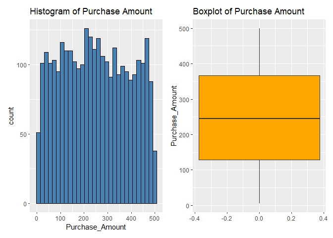<!-- -->

``` r
hist_items <- ggplot(eda, aes(x = Number_of_Items)) +
  geom_histogram(bins = 20, fill = "darkgreen", color = "black") +
  labs(title = "Histogram of Number of Items")

box_items <- ggplot(eda, aes(y = Number_of_Items)) +
  geom_boxplot(fill = "lightgreen") +
  labs(title = "Boxplot of Number of Items")

(hist_items + box_items) + 
  plot_layout(ncol = 2)
```

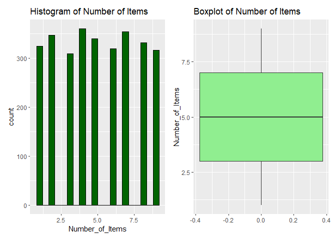<!-- -->

``` r
hist_sat <- ggplot(eda, aes(x = Satisfaction_Score)) +
  geom_histogram(bins = 5, fill = "purple", color = "black") +
  labs(title = "Histogram of Satisfaction Score")

box_sat <- ggplot(eda, aes(y = Satisfaction_Score)) +
  geom_boxplot(fill = "violet") +
  labs(title = "Boxplot of Satisfaction Score")

(hist_sat + box_sat) + 
  plot_layout(ncol = 2)
```

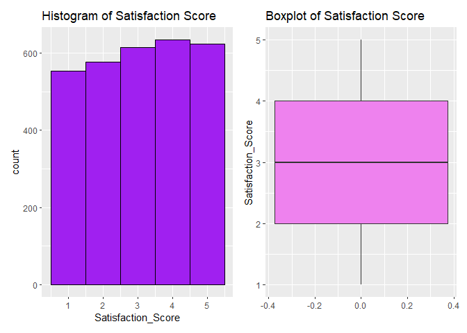<!-- -->

### Purchase Amount

The histogram and boxplot show that Purchase_Amount ranges roughly from
0 to 500, with spending spread relatively evenly across this range.  
This indicates that customers exhibit diverse purchasing patterns, where
some make small purchases while others spend significantly more.

### Number of Items

The distribution of Number_of_Items shows that most transactions involve
between 4 and 7 items, suggesting customers frequently purchase multiple
items in a single transaction.  
The histogram indicates a moderately concentrated distribution and
boxplot does not show strong outliers, implying that purchasing behavior
in terms of quantity is relatively consistent across customers.  
This suggests customers may often purchase bundles or multiple related
products during each transaction.

### Satisfaction Score

The histogram indicates that scores are fairly evenly distributed, with
many observations around the middle values and boxplot suggests moderate
central tendency without strong skewness.  
This implies that the dataset contains a mix of satisfied and moderately
satisfied customers, providing a realistic representation of customer
feedback rather than being dominated by extremely positive or negative
experiences.

#### B. Central Tendency

``` r
# mean
mean(eda$Purchase_Amount)
```

    ## [1] 247.9625

``` r
# median
median(eda$Purchase_Amount)
```

    ## [1] 245.09

``` r
# mode
mode_purchase <- as.numeric(names(sort(table(eda$Purchase_Amount), decreasing = TRUE)[1]))

# variance
var(eda$Purchase_Amount)
```

    ## [1] 19845.99

``` r
# standard deviation
sd(eda$Purchase_Amount)
```

    ## [1] 140.8758

``` r
# IQR
IQR(eda$Purchase_Amount)
```

    ## [1] 238.505

### Interpretation of Purchase Amount Central Tendencies

The mean (247.96) and median (245.09) are very close, indicating the
distribution is approximately symmetric with minimal skewness.

The large standard deviation (~140.88) and IQR (~238.51) suggest
substantial variability in customer spending behavior and explains the
mode values too.

#### C. Distribution via Gender

``` r
ggplot(eda, aes(x = Browsing_Time, fill = Gender)) +
  geom_density(alpha = 0.4) +
  labs(title = "Browsing Time Distribution by Gender")
```

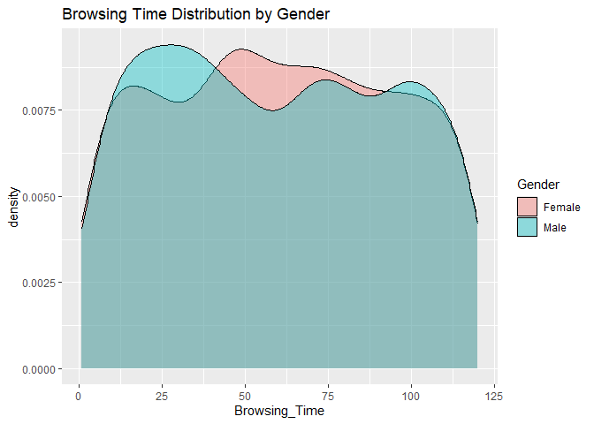<!-- -->

``` r
ggplot(eda, aes(x = Purchase_Amount, fill = Gender)) +
  geom_density(alpha = 0.4) +
  labs(title = "Purchase Amount Distribution by Gender")
```

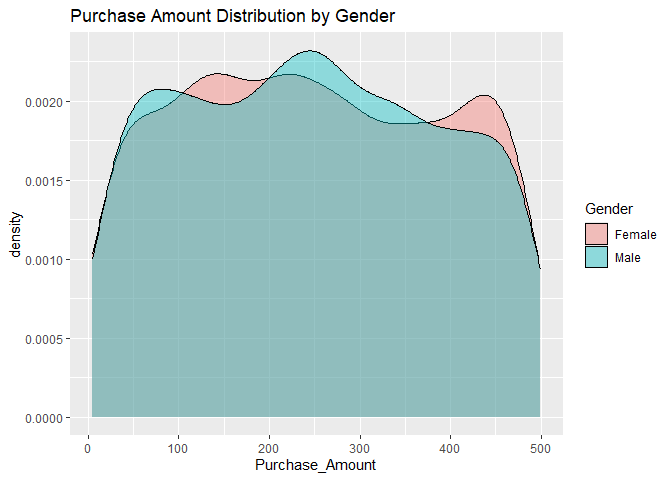<!-- -->

### Interpretation

Browsing Time  
Male and female curves almost overlap completely.  
Both genders have similar browsing behavior.

Purchase Amount Spending distributions for males and females are very
similar.

Gender does not appear to strongly influence browsing or spending
behavior in this dataset.  
Gender may not be a strong predictor variable in predictive models.

#### D. Transformations and Skewness

``` r
eda$log_Browsing_Time <- log(eda$Browsing_Time)
eda$sqrt_Browsing_Time <- sqrt(eda$Browsing_Time)
ggplot(eda, aes(x = Browsing_Time)) +
  geom_histogram(aes(y = after_stat(density)), bins = 30,
                 fill = "lightblue", color = "black") +
  geom_density(color = "red", linewidth = 1) +
  labs(title = "Browsing Time Distribution",
       x = "Browsing Time",
       y = "Density")
```

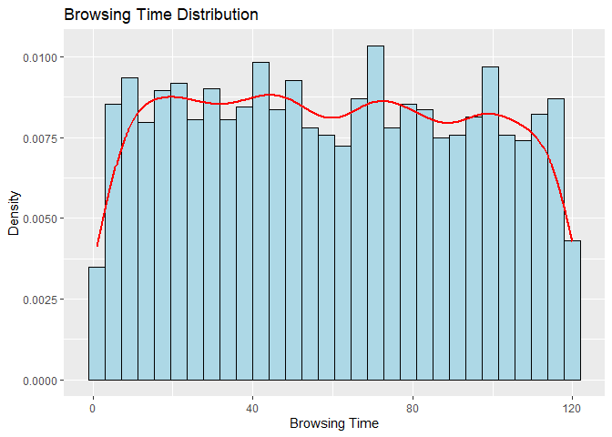<!-- -->

``` r
ggplot(eda, aes(x = log_Browsing_Time)) +
  geom_histogram(aes(y = after_stat(density)), bins = 30,
                 fill = "lightgreen", color = "black") +
  geom_density(color = "red", linewidth = 1) +
  labs(title = "Log Transformed Browsing Time")
```

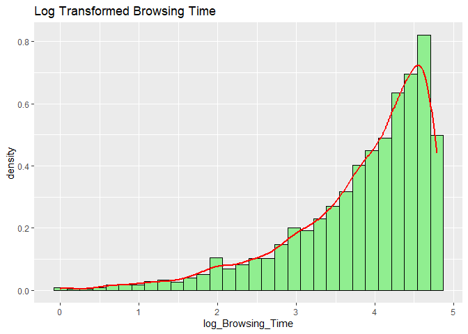<!-- -->

``` r
ggplot(eda, aes(x = sqrt_Browsing_Time)) +
  geom_histogram(aes(y = after_stat(density)), bins = 30,
                 fill = "orange", color = "black") +
  geom_density(color = "red", linewidth = 1) +
  labs(title = "Square Root Transformed Browsing Time")
```

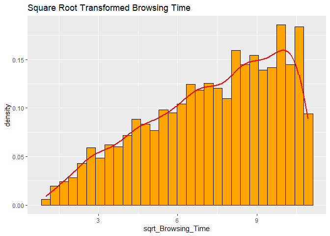<!-- -->

#### E. Simple Linear Regression (Purchase_Amount)

``` r
model <- lm(Purchase_Amount ~ Browsing_Time, data = eda)

summary(model)
```

    ## 
    ## Call:
    ## lm(formula = Purchase_Amount ~ Browsing_Time, data = eda)
    ## 
    ## Residuals:
    ##      Min       1Q   Median       3Q      Max 
    ## -244.867 -120.473   -2.946  118.246  254.069 
    ## 
    ## Coefficients:
    ##                Estimate Std. Error t value Pr(>|t|)    
    ## (Intercept)   252.65596    5.17524  48.820   <2e-16 ***
    ## Browsing_Time  -0.07839    0.07501  -1.045    0.296    
    ## ---
    ## Signif. codes:  0 '***' 0.001 '**' 0.01 '*' 0.05 '.' 0.1 ' ' 1
    ## 
    ## Residual standard error: 140.9 on 2998 degrees of freedom
    ## Multiple R-squared:  0.0003642,  Adjusted R-squared:  3.075e-05 
    ## F-statistic: 1.092 on 1 and 2998 DF,  p-value: 0.2961

#### Interpretation

Slope: Each additional unit of browsing time slightly decreases purchase
amount by ~0.078.

However: p-value = 0.296 (\>0.05), The relationship is not statistically
significant.

R²: 0.00036 means browsing time explains less than 0.04% of purchase
variation. Browsing time does not meaningfully predict purchase amount.

Other variables likely drive purchasing behavior.  
Possible predictors: Number_of_Items, Discounts, Category,
Total_Transactions

#### F. Plotting SLR

``` r
par(mfrow = c(2,2))
plot(model)
```

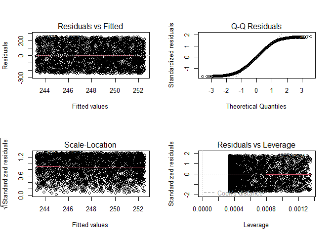<!-- -->

``` r
ggplot(eda, aes(x = Browsing_Time, y = Purchase_Amount)) +
  geom_point(alpha = 0.5) +
  geom_smooth(method = "lm", color = "red", se = TRUE) +
  labs(
    title = "Browsing Time vs Purchase Amount",
    x = "Browsing Time",
    y = "Purchase Amount"
  )
```

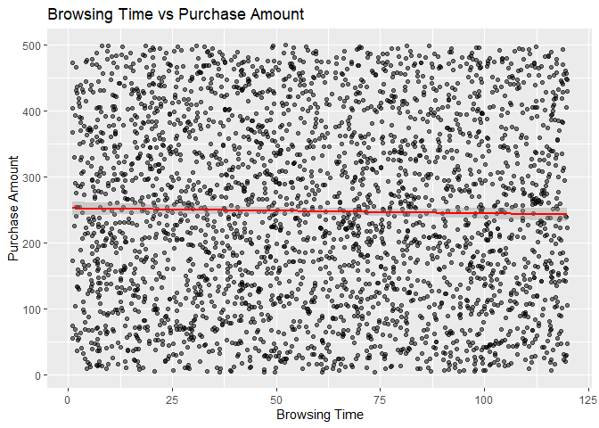<!-- -->

#### QQ / Residuals

Points appear randomly scattered, No obvious curve pattern.  
Model has very little explanatory power.  
Points deviate slightly from the line at the tails, Mild non-normality
exists.

#### Variance / Leverage

Residual spread appears relatively uniform, No strong funnel pattern.  
A few points appear outside the main cluster, However none strongly
exceed Cook’s distance thresholds.

#### Regression Line

Points are randomly scattered across the space.  
The regression line is almost flat, This visual confirms the statistical
result that Browsing time does not meaningfully influence purchase
amount.

## II. Bivariate Data Analysis

#### A. Relationship Scatterplot

``` r
ggplot(eda, aes(x = Number_of_Items, y = Purchase_Amount)) +
  geom_point(alpha = 0.5) +
  geom_smooth(method = "lm", color = "red", se = TRUE) +
  labs(
    title = "Purchase Amount vs Number of Items",
    x = "Number of Items",
    y = "Purchase Amount"
  )
```

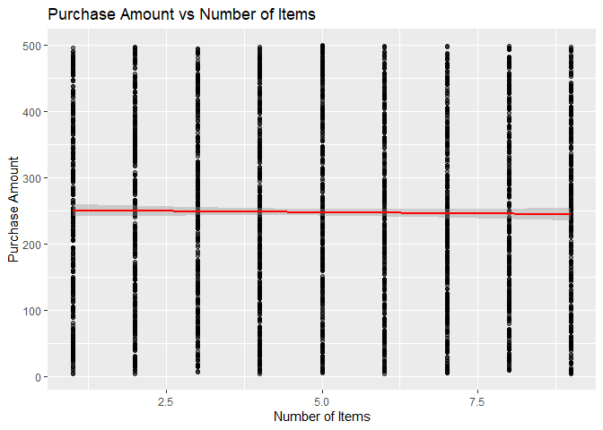<!-- -->

#### Interpretation

The scatter plot shows the relationship between Number_of_Items and
Purchase_Amount, with a wide spread of points across the range.

Although more items could theoretically increase total spending, the
regression line is nearly flat, indicating no strong linear relationship
in the dataset.

#### B. Regression Model

``` r
linear_model <- lm(Purchase_Amount ~ Browsing_Time, data = eda)
summary(linear_model)
```

    ## 
    ## Call:
    ## lm(formula = Purchase_Amount ~ Browsing_Time, data = eda)
    ## 
    ## Residuals:
    ##      Min       1Q   Median       3Q      Max 
    ## -244.867 -120.473   -2.946  118.246  254.069 
    ## 
    ## Coefficients:
    ##                Estimate Std. Error t value Pr(>|t|)    
    ## (Intercept)   252.65596    5.17524  48.820   <2e-16 ***
    ## Browsing_Time  -0.07839    0.07501  -1.045    0.296    
    ## ---
    ## Signif. codes:  0 '***' 0.001 '**' 0.01 '*' 0.05 '.' 0.1 ' ' 1
    ## 
    ## Residual standard error: 140.9 on 2998 degrees of freedom
    ## Multiple R-squared:  0.0003642,  Adjusted R-squared:  3.075e-05 
    ## F-statistic: 1.092 on 1 and 2998 DF,  p-value: 0.2961

``` r
poly_model <- lm(Purchase_Amount ~ poly(Browsing_Time, 2), data = eda)
summary(poly_model)
```

    ## 
    ## Call:
    ## lm(formula = Purchase_Amount ~ poly(Browsing_Time, 2), data = eda)
    ## 
    ## Residuals:
    ##     Min      1Q  Median      3Q     Max 
    ## -245.47 -120.41   -3.49  118.25  255.85 
    ## 
    ## Coefficients:
    ##                         Estimate Std. Error t value Pr(>|t|)    
    ## (Intercept)              247.963      2.572  96.397   <2e-16 ***
    ## poly(Browsing_Time, 2)1 -147.227    140.892  -1.045    0.296    
    ## poly(Browsing_Time, 2)2  -68.129    140.892  -0.484    0.629    
    ## ---
    ## Signif. codes:  0 '***' 0.001 '**' 0.01 '*' 0.05 '.' 0.1 ' ' 1
    ## 
    ## Residual standard error: 140.9 on 2997 degrees of freedom
    ## Multiple R-squared:  0.0004422,  Adjusted R-squared:  -0.0002249 
    ## F-statistic: 0.6629 on 2 and 2997 DF,  p-value: 0.5154

``` r
ggplot(eda, aes(x = Browsing_Time, y = Purchase_Amount)) +
  geom_point(alpha = 0.4) +
  geom_smooth(method = "lm", formula = y ~ poly(x,2), color = "blue") +
  labs(title = "Polynomial Regression: Purchase Amount vs Browsing Time")
```

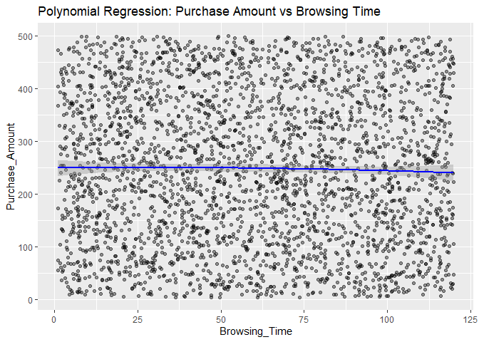<!-- -->

#### Interpretation

The polynomial regression model does not significantly improve model
performance compared to the linear model, as both models show extremely
low R² values.

The polynomial terms are not statistically significant, suggesting that
browsing time has no meaningful nonlinear relationship with purchase
amount.

#### C. LOESS Visualize

``` r
ggplot(eda, aes(x = Browsing_Time, y = Purchase_Amount)) +
  geom_point(alpha = 0.4) +
  geom_smooth(method = "loess", color = "green", se = TRUE) +
  labs(
    title = "LOESS Smoothing: Purchase Amount vs Browsing Time",
    x = "Browsing Time",
    y = "Purchase Amount"
  )
```

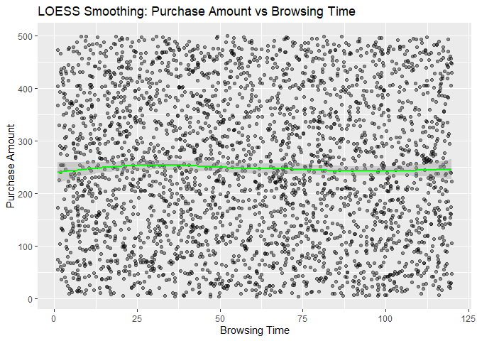<!-- -->

#### Interpretation

The LOESS smoothing curve remains nearly flat across browsing time,
indicating that there is no strong nonlinear trend in the data.

This supports the conclusion that browsing time alone does not
meaningfully influence customer spending behavior.

#### D. Robust Regression

``` r
ols_model <- lm(Purchase_Amount ~ Browsing_Time, data = eda)
summary(ols_model)
```

    ## 
    ## Call:
    ## lm(formula = Purchase_Amount ~ Browsing_Time, data = eda)
    ## 
    ## Residuals:
    ##      Min       1Q   Median       3Q      Max 
    ## -244.867 -120.473   -2.946  118.246  254.069 
    ## 
    ## Coefficients:
    ##                Estimate Std. Error t value Pr(>|t|)    
    ## (Intercept)   252.65596    5.17524  48.820   <2e-16 ***
    ## Browsing_Time  -0.07839    0.07501  -1.045    0.296    
    ## ---
    ## Signif. codes:  0 '***' 0.001 '**' 0.01 '*' 0.05 '.' 0.1 ' ' 1
    ## 
    ## Residual standard error: 140.9 on 2998 degrees of freedom
    ## Multiple R-squared:  0.0003642,  Adjusted R-squared:  3.075e-05 
    ## F-statistic: 1.092 on 1 and 2998 DF,  p-value: 0.2961

``` r
library(MASS)

huber_model <- rlm(Purchase_Amount ~ Browsing_Time, data = eda)
summary(huber_model)
```

    ## 
    ## Call: rlm(formula = Purchase_Amount ~ Browsing_Time, data = eda)
    ## Residuals:
    ##      Min       1Q   Median       3Q      Max 
    ## -244.818 -120.331   -2.848  118.291  254.289 
    ## 
    ## Coefficients:
    ##               Value    Std. Error t value 
    ## (Intercept)   252.6462   5.3363    47.3448
    ## Browsing_Time  -0.0803   0.0773    -1.0378
    ## 
    ## Residual standard error: 176.9 on 2998 degrees of freedom

``` r
tukey_model <- rlm(Purchase_Amount ~ Browsing_Time, data = eda, psi = psi.bisquare)
summary(tukey_model)
```

    ## 
    ## Call: rlm(formula = Purchase_Amount ~ Browsing_Time, data = eda, psi = psi.bisquare)
    ## Residuals:
    ##      Min       1Q   Median       3Q      Max 
    ## -244.823 -119.866   -2.644  118.511  255.023 
    ## 
    ## Coefficients:
    ##               Value    Std. Error t value 
    ## (Intercept)   252.8187   5.5699    45.3899
    ## Browsing_Time  -0.0883   0.0807    -1.0942
    ## 
    ## Residual standard error: 176.8 on 2998 degrees of freedom

``` r
ggplot(eda, aes(Browsing_Time, Purchase_Amount)) +
  geom_point(alpha = 0.4) +
  geom_abline(intercept = coef(ols_model)[1],
              slope = coef(ols_model)[2],
              color = "red") +
  geom_abline(intercept = coef(huber_model)[1],
              slope = coef(huber_model)[2],
              color = "blue") +
  labs(title = "OLS vs Robust Regression",
       x = "Browsing Time",
       y = "Purchase Amount")
```

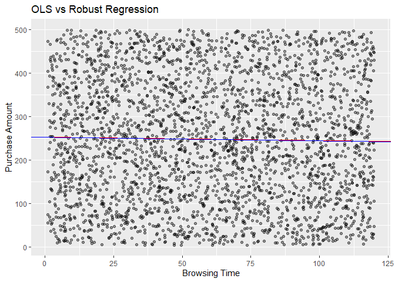<!-- -->

#### Interpretation

Robust regression methods such as Huber and Tukey produce coefficients
very similar to the OLS regression results, indicating that outliers do
not strongly affect the model.

This suggests that the weak relationship between browsing time and
purchase amount is not caused by extreme observations but reflects the
underlying data structure.

## III. Trivariate/Hypervariate Data Analysis

#### A. Interaction Effects

``` r
ggplot(eda, aes(Browsing_Time, Purchase_Amount, color = Category)) +
  geom_point(alpha = 0.4) +
  geom_smooth(method = "lm", se = FALSE) +
  labs(
    title = "Interaction: Browsing Time and Category on Purchase Amount"
  )
```

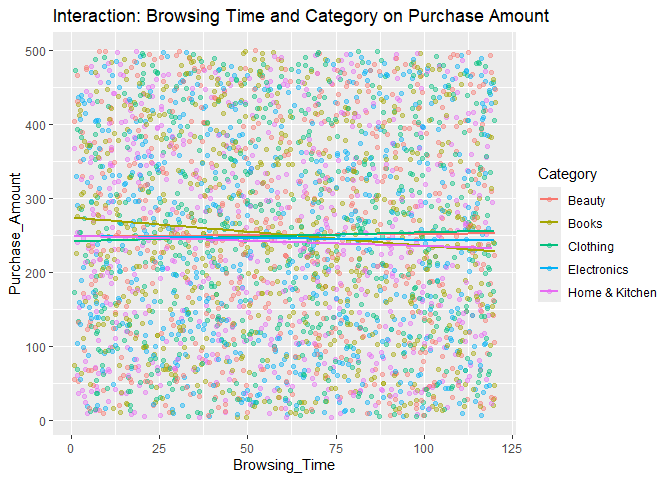<!-- -->

#### Interpretation

The interaction plot shows that regression lines across product
categories are relatively flat and similar in slope the most different
being books category.

This suggests that product category does not significantly modify the
relationship between browsing time and purchase amount.

#### B. Coplots

``` r
ggplot(eda, aes(Browsing_Time, Purchase_Amount)) +
  geom_point(alpha = 0.4) +
  geom_smooth(method = "lm") +
  facet_wrap(~Category)
```

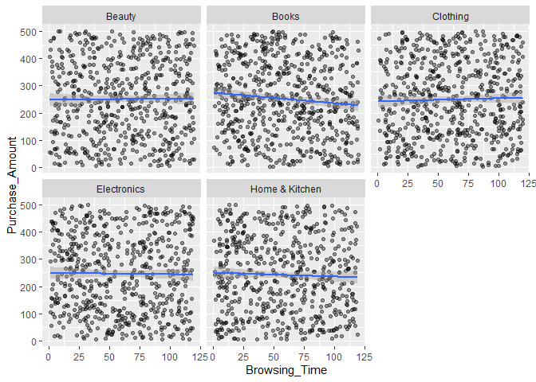<!-- -->

#### Interpretation

Coplots display browsing time versus purchase amount separately for each
category, and the scatter patterns appear similar across all panels and
the most different also being the books category same conclusion as A
plot.

This indicates that customer spending behavior does not vary strongly
with browsing time regardless of product category.

#### C. Level/ Contour Plots

``` r
## install.packages("akima")
library(akima)

interp_data <- with(eda,
  interp(
    x = Browsing_Time,
    y = Number_of_Items,
    z = Purchase_Amount,
    duplicate = "mean"
  )
)

grid_data <- expand.grid(
  Browsing_Time = interp_data$x,
  Number_of_Items = interp_data$y
)

grid_data$Purchase_Amount <- as.vector(interp_data$z)

ggplot(grid_data, aes(Browsing_Time, Number_of_Items, z = Purchase_Amount)) +
  geom_contour_filled(bins = 10) +
  scale_fill_viridis_d() +
  labs(
    title = "Contour Plot of Purchase Amount",
    x = "Browsing Time",
    y = "Number of Items"
  )
```

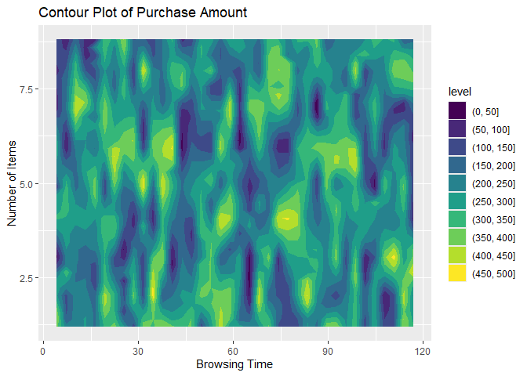<!-- -->

``` r
library(lattice)

levelplot(Purchase_Amount ~ Browsing_Time * Number_of_Items,
          data = eda,
          col.regions = terrain.colors(100))
```

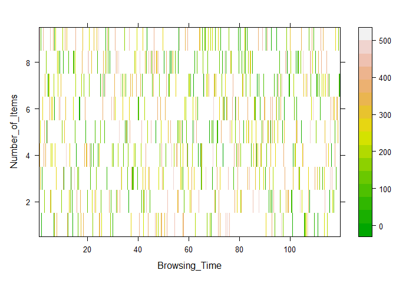<!-- -->

#### Interpretation

The contour plot visualizes spending levels across combinations of
Browsing_Time and Number_of_Items.

The irregular contour patterns indicate high variability in purchase
amounts, suggesting that spending behavior is influenced by factors
beyond browsing time or item count alone.

The level plot visualizes the relationship between Browsing_Time,
Number_of_Items, and Purchase_Amount using color intensity to represent
purchase values. The irregular and striped pattern indicates high
variability in purchase amounts across similar browsing times and item
counts. This suggests that browsing time and item count alone do not
strongly determine purchase amount, as spending varies widely even
within the same ranges of these variables. The absence of clear
gradients or smooth regions indicates weak relationships among the
variables, supporting earlier regression results showing low explanatory
power.

#### D. Multiple Linear Regression

``` r
multi_model <- lm(
  Purchase_Amount ~ Browsing_Time + Number_of_Items + Satisfaction_Score,
  data = eda
)

summary(multi_model)
```

    ## 
    ## Call:
    ## lm(formula = Purchase_Amount ~ Browsing_Time + Number_of_Items + 
    ##     Satisfaction_Score, data = eda)
    ## 
    ## Residuals:
    ##      Min       1Q   Median       3Q      Max 
    ## -250.668 -120.856   -2.846  118.899  255.664 
    ## 
    ## Coefficients:
    ##                     Estimate Std. Error t value Pr(>|t|)    
    ## (Intercept)        261.34993    9.24929  28.256   <2e-16 ***
    ## Browsing_Time       -0.07954    0.07504  -1.060    0.289    
    ## Number_of_Items     -0.78321    1.00497  -0.779    0.436    
    ## Satisfaction_Score  -1.53871    1.83444  -0.839    0.402    
    ## ---
    ## Signif. codes:  0 '***' 0.001 '**' 0.01 '*' 0.05 '.' 0.1 ' ' 1
    ## 
    ## Residual standard error: 140.9 on 2996 degrees of freedom
    ## Multiple R-squared:  0.0007932,  Adjusted R-squared:  -0.0002073 
    ## F-statistic: 0.7928 on 3 and 2996 DF,  p-value: 0.4978

``` r
step_model <- step(multi_model, direction = "both")
```

    ## Start:  AIC=29691.89
    ## Purchase_Amount ~ Browsing_Time + Number_of_Items + Satisfaction_Score
    ## 
    ##                      Df Sum of Sq      RSS   AIC
    ## - Number_of_Items     1     12056 59482958 29691
    ## - Satisfaction_Score  1     13966 59484867 29691
    ## - Browsing_Time       1     22299 59493201 29691
    ## <none>                            59470902 29692
    ## 
    ## Step:  AIC=29690.5
    ## Purchase_Amount ~ Browsing_Time + Satisfaction_Score
    ## 
    ##                      Df Sum of Sq      RSS   AIC
    ## - Satisfaction_Score  1     13479 59496437 29689
    ## - Browsing_Time       1     21541 59504498 29690
    ## <none>                            59482958 29691
    ## + Number_of_Items     1     12056 59470902 29692
    ## 
    ## Step:  AIC=29689.18
    ## Purchase_Amount ~ Browsing_Time
    ## 
    ##                      Df Sum of Sq      RSS   AIC
    ## - Browsing_Time       1     21676 59518113 29688
    ## <none>                            59496437 29689
    ## + Satisfaction_Score  1     13479 59482958 29691
    ## + Number_of_Items     1     11569 59484867 29691
    ## 
    ## Step:  AIC=29688.27
    ## Purchase_Amount ~ 1
    ## 
    ##                      Df Sum of Sq      RSS   AIC
    ## <none>                            59518113 29688
    ## + Browsing_Time       1     21676 59496437 29689
    ## + Satisfaction_Score  1     13614 59504498 29690
    ## + Number_of_Items     1     10822 59507290 29690

``` r
summary(step_model)
```

    ## 
    ## Call:
    ## lm(formula = Purchase_Amount ~ 1, data = eda)
    ## 
    ## Residuals:
    ##      Min       1Q   Median       3Q      Max 
    ## -242.933 -119.268   -2.873  119.237  251.647 
    ## 
    ## Coefficients:
    ##             Estimate Std. Error t value Pr(>|t|)    
    ## (Intercept)  247.963      2.572   96.41   <2e-16 ***
    ## ---
    ## Signif. codes:  0 '***' 0.001 '**' 0.01 '*' 0.05 '.' 0.1 ' ' 1
    ## 
    ## Residual standard error: 140.9 on 2999 degrees of freedom

``` r
library(lm.beta)

lm.beta(multi_model)
```

    ## 
    ## Call:
    ## lm(formula = Purchase_Amount ~ Browsing_Time + Number_of_Items + 
    ##     Satisfaction_Score, data = eda)
    ## 
    ## Standardized Coefficients::
    ##        (Intercept)      Browsing_Time    Number_of_Items Satisfaction_Score 
    ##                 NA        -0.01936166        -0.01423912        -0.01532117

``` r
library(relaimpo)

calc.relimp(multi_model, type = "lmg")
```

    ## Response variable: Purchase_Amount 
    ## Total response variance: 19845.99 
    ## Analysis based on 3000 observations 
    ## 
    ## 3 Regressors: 
    ## Browsing_Time Number_of_Items Satisfaction_Score 
    ## Proportion of variance explained by model: 0.08%
    ## Metrics are not normalized (rela=FALSE). 
    ## 
    ## Relative importance metrics: 
    ## 
    ##                             lmg
    ## Browsing_Time      0.0003693909
    ## Number_of_Items    0.0001921671
    ## Satisfaction_Score 0.0002316626
    ## 
    ## Average coefficients for different model sizes: 
    ## 
    ##                             1X         2Xs         3Xs
    ## Browsing_Time      -0.07839485 -0.07895365 -0.07953664
    ## Number_of_Items    -0.74170380 -0.76252549 -0.78320565
    ## Satisfaction_Score -1.51892157 -1.52843903 -1.53870794

#### Interpretation

The multiple regression model including Browsing_Time, Number_of_Items,
and Satisfaction_Score shows that none of the predictors are
statistically significant.

Stepwise model selection removes all predictors, leaving only the
intercept, indicating that these variables collectively explain very
little variation in purchase amount.

### Final Conclusion:

Univariate analysis showed that Purchase_Amount varies widely among
customers, with values ranging roughly from 0 to 500. Measures of
central tendency indicated a relatively symmetric distribution but with
large variability, suggesting diverse spending behaviors across
customers.

Gender comparisons revealed that browsing time and purchase amount
distributions are very similar for male and female customers, indicating
that gender does not significantly influence browsing or spending
behavior in this dataset.

Bivariate analysis demonstrated that browsing time has almost no
meaningful relationship with purchase amount. Both linear, polynomial,
and LOESS models produced nearly flat trends and extremely low R²
values, confirming that browsing duration alone does not explain
spending patterns.

Robust regression analysis showed results very similar to ordinary least
squares regression, suggesting that outliers do not strongly affect the
relationship between browsing time and purchase amount and reinforcing
the conclusion that the relationship is inherently weak.

Trivariate and multiple regression analyses further confirmed that
browsing time, number of items, and satisfaction score collectively
explain very little variation in purchase amount. This suggests that
other variables not included in the model, such as product pricing,
discounts, or category-specific factors, may play a larger role in
determining customer spending.
